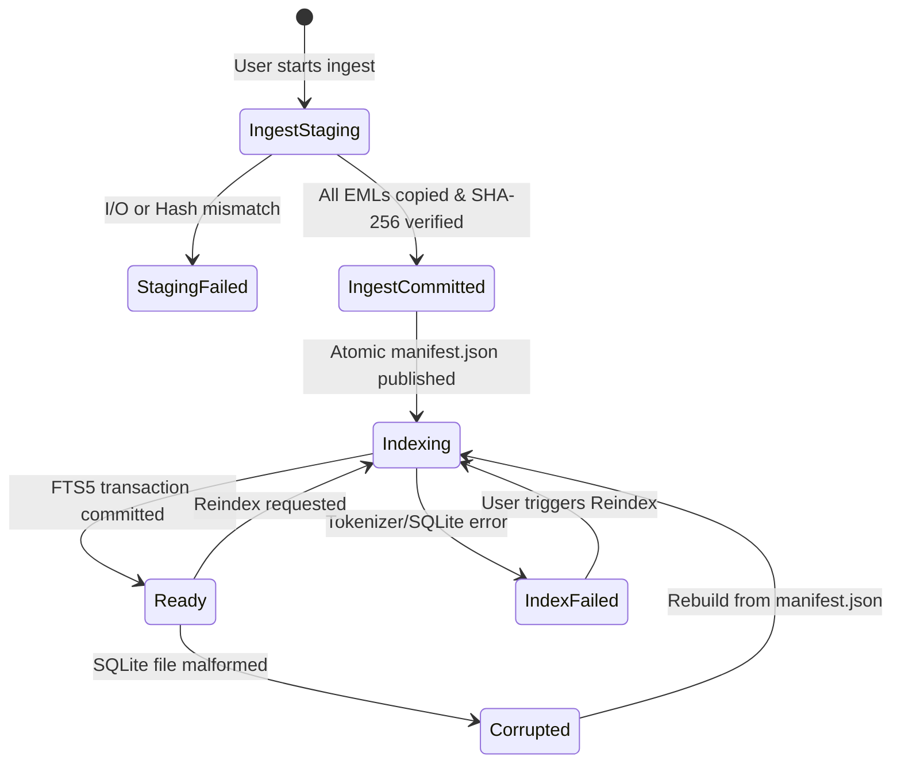

# TASK-018 Architecture Discovery Gate: Local Archive Management & Multi-Scope Search

**TASK_ID:** TASK-018  
**STATUS:** DISCOVERY COMPLETE / PENDING ASTRA ACCEPTANCE & HANDOFF  
**EXECUTOR:** GEMINI (Official Antigravity)  
**CONTROLLER:** SOL / ASTRA HIGH  
**SCOPE:** Read-only architecture discovery for real managed EML/mboxrd archives with multi-company/project/archive search and safe message preview. No production, backend, frontend, dependency, or test files modified. No servers started, no accounts accessed, no tasks mutated.

---

## 1. Executive Summary & Architecture Boundary

TASK-018 establishes a production-grade, local, managed email archive and multi-scope search engine. It bridges raw file archives (EML files, EML directory trees, mboxrd mailboxes) and completed TASK-017 bridge export jobs into an immutable managed storage hierarchy, backed by a rebuildable `Microsoft.Data.Sqlite 10.0.12` FTS5 search index.

### Verbatim LOCKED_ARCHITECTURE Compliance
1. **Exact SQLite Engine**: `Microsoft.Data.Sqlite 10.0.12` (net8.0, native SQLite 3.53.3, FTS5 `tokenize='unicode61 remove_diacritics 0'`) approved by root isolated probe (10/10 PASS). No additional third-party dependencies.
2. **Raw MIME Immutability**: Source raw MIME bytes are preserved byte-for-byte. Each physical record remains distinct, even if sharing identical `Message-ID` or identical SHA-256 hash. Source files are never modified or deleted; ingestion is strictly a copy operation.
3. **Triple Scope Binding**: Every archive is permanently bound to `(companyId, projectId, archiveId)`. Every search, count, or preview request validates selected triples server-side; invalid or mismatched triples are rejected fail-closed.
4. **Empty-Selection-Empty**: Zero selected archives immediately yields zero results. Empty selection is never a wildcard over all data.
5. **Preview Safety Boundaries**: Raw HTML is never executed; JavaScript is never run; remote images and web beacons are never fetched. Preview is rendered as safe text with React character escaping.
6. **FTS Sanitization & Folding**: Queries are parsed into plain literal terms enclosed in double-quotes, combined via `AND`. User SQL/FTS program execution (operators, asterisks, column prefixes) is blocked. Text is normalized via Unicode Form C (NFC) + Turkish `tr-TR` lowercase folding, followed by `ı` -> `i` substitution exclusively on the searchable index copy; raw subject and body remain pristine.
7. **Attachment & Body Rules**: Inline parts with filenames (e.g., `logo.png`) are indexed and counted as attachments. The searchable body excludes external or detached file attachment contents.
8. **Manifest Autonomy**: Managed storage maintains an immutable `manifest.json` independent of SQLite. If the SQLite database is deleted, corrupted, or encounters a schema mismatch, it can be fully rebuilt from managed storage without accessing original external source media.

---

## 2. Current Integration Points & Exact Existing Symbols / Files

### A. Bridge Source Descriptors & Native Handles (TASK-017)
- [`FileHandleRegistry.cs`](file:///C:/Users/Eddiz/Documents/ChatGPT/Mail%20Manager/engine/BitigMail.LocalHost/Dialogs/FileHandleRegistry.cs):
  - `RegisterMimeSource(MimeSourceManifest manifest, string displayPath)` -> generates opaque handle `msrc_<guid>`.
  - `GetMimeSourceEntry(string handle)` -> returns `MimeSourceHandleEntry` containing `Manifest`, `SourceKind`, `Dialect`, `RootPath`, `BoundFingerprint`, and `BoundItemCount`.
  - `RegisterOutputDir(string fullPath)` -> generates `dir_<guid>`.
- [`MimeSourceInspector.cs`](file:///C:/Users/Eddiz/Documents/ChatGPT/Mail%20Manager/engine/BitigMail.Engine/Storage/MimeSourceInspector.cs):
  - `BuildEmlFilesManifest(IEnumerable<string> filePaths, string? defaultFolder)`: Inspects individual EML files, enforces reparse point checks, computes per-file SHA-256 and `AggregateFingerprint`.
  - `BuildEmlDirectoryManifest(string directoryPath)`: Recursively traverses directory trees, maps relative folder paths to IMAP/archive folder names, and computes physical ordinals.
  - `BuildMboxManifest(string mboxFilePath, string? defaultFolder)`: Scans mboxrd records via `MboxrdRecordReader`, computes per-record SHA-256.
  - `ComputeManifestFingerprint(MimeSourceManifest manifest)`: Deterministic SHA-256 over source kind, dialect, ordinals, paths, sizes, and hashes.
- [`MboxrdRecordReader.cs`](file:///C:/Users/Eddiz/Documents/ChatGPT/Mail%20Manager/engine/BitigMail.Engine/Storage/MboxrdRecordReader.cs):
  - `EnumerateRecords(Stream stream)`: Yields `MboxrdRecord` (`Ordinal`, `RawMimeBytes`, `EnvelopeFrom`).
  - `UnescapeMboxrdLine(byte[] line)`: Exactly reverses one level of mboxrd `From ` escaping (`^>+From ` -> removes first `>`). Preserves trailing CRLF/LF and blank lines.
- [`LocalEngineApiEndpoints.BridgeTransfer.cs`](file:///C:/Users/Eddiz/Documents/ChatGPT/Mail%20Manager/engine/BitigMail.LocalHost/LocalEngineApiEndpoints.BridgeTransfer.cs):
  - `HandleBridgeSourceDescribe(handleRegistry, req)`: Exposed at `POST /api/transfer/bridge/source/describe` and `GET /api/transfer/bridge/source/descriptor/{sourceHandle}`. Returns `BridgeSourceDescriptorResponse` (`SourceKind`, `Dialect`, `DisplayPath`, `TotalFiles`, `TotalItems`, `TotalSizeBytes`, `Folders`, `IgnoredNonEmlFilesCount`). Reusable as preflight for archive ingestion.
- **TASK-017 Bridge Export Job as Archive Source**:
  - `BridgeExportWorker.cs` ([`BridgeExportWorker.cs`](file:///C:/Users/Eddiz/Documents/ChatGPT/Mail%20Manager/engine/BitigMail.LocalHost/Bridge/Transfer/BridgeExportWorker.cs)): Writes `manifest.json` (`BridgeExportManifest`) into `jobOutputDir` (`bridge-export-<jobId>`), containing completed item list with `SourceSha256`, `StoredSha256`, `RelativeOutputPath`, `OriginalMimeDateUtc`, `InternalDateUtc`, `Flags`, `Keywords`.
  - Can be added directly to the archive catalog via an explicit "Arşive Ekle" action using the existing `jobId` and its bound `ClientProjectContext`.

### B. Job, Report, Storage, and JobCenter
- [`JobManager.cs`](file:///C:/Users/Eddiz/Documents/ChatGPT/Mail%20Manager/engine/BitigMail.LocalHost/Jobs/JobManager.cs):
  - Manages `runtimeDir` (`runtime/local-engine`), `jobs/`, and `reports/`.
  - Manages concurrency gate `_activeRunningJobId`, `_jobLock`, and startup recovery `RecoverInterruptedJobsOnStartup()`.
- [`LocalJobRecord.cs`](file:///C:/Users/Eddiz/Documents/ChatGPT/Mail%20Manager/engine/BitigMail.LocalHost/Jobs/LocalJobRecord.cs):
  - Holds `JobId`, `JobKind`, `Status` (`queued`, `converting`, `verifying`, `completed`, `failed`, `interrupted`), `Stage`, `ClientContext` (`CompanyId`, `ProjectId`, `CompanyName`, `ProjectName`), `PercentComplete`, `TotalItems`, `ItemsWritten`.
- [`JobCenter.tsx`](file:///C:/Users/Eddiz/Documents/ChatGPT/Mail%20Manager/prototype/src/components/jobs/JobCenter.tsx):
  - Displays background engine jobs, reports, statuses, and navigation to workspace/audit.

### C. ArchiveSearchView, State, and Client Flows
- [`ArchiveSearchView.tsx`](file:///C:/Users/Eddiz/Documents/ChatGPT/Mail%20Manager/prototype/src/components/search/ArchiveSearchView.tsx):
  - **Left Panel**: Company -> Project -> Source tree. Checkboxes with tri-state indeterminate support on company and project nodes.
  - **State**: `selectedSourceIds` (`state.searchSelectedSourceIds`). Empty selection yields zero results (`"Konum seçilmedi · 0 sonuç"`).
  - **Right Panel**: Search input (`query`), folder filter (`folderFilter`), results table (Sender, Subject, Location, Date, Size), and preview pane (`MessagePreview`).
  - **Current Prototype Seam**: Currently relies on `getMessagesForSourceIds()` from mock data `sampleMessages.ts` and in-memory substring filtering. Needs real API integration.
- [`useAppState.ts`](file:///C:/Users/Eddiz/Documents/ChatGPT/Mail%20Manager/prototype/src/state/useAppState.ts):
  - Maintains `companies`, `projects`, `sources`, and `searchSelectedSourceIds` with persistence via `storage.ts`.
- [`MessagePreview.tsx`](file:///C:/Users/Eddiz/Documents/ChatGPT/Mail%20Manager/prototype/src/components/workspace/MessagePreview.tsx):
  - Renders message subject, sender, date, attachment pills, and body text. Must receive sanitized plain-text preview from backend.

---

## 3. Proposed DTOs, Endpoints, and Durable State Transitions

All new endpoints reside under the `/api/archive/*` route group without duplicating or breaking existing `/api/transfer/*` or `/api/jobs/*` routes.

### A. Endpoints

| Method | Route | Description |
|---|---|---|
| `POST` | `/api/archive/ingest/preview` | Generates immutable preflight analysis for an archive source handle (`msrc_...` or completed bridge export job). |
| `POST` | `/api/archive/ingest/start` | Starts background ingestion of raw MIME files into managed archive storage and builds initial index. |
| `GET` | `/api/archive/catalog` | Lists all registered managed archives with their bound `(companyId, projectId)` triples and statuses. |
| `GET` | `/api/archive/{archiveId}/manifest` | Returns safe manifest metadata for a registered archive (no server absolute paths). |
| `POST` | `/api/archive/search` | Performs multi-archive FTS5 and metadata query across strictly validated scope triples. |
| `POST` | `/api/archive/message/preview` | Fetches safe, sanitized plain-text message preview for a specific message within a validated triple. |
| `POST` | `/api/archive/{archiveId}/reindex` | Rebuilds SQLite FTS5 index for a specific archive directly from its immutable raw EML storage. |
| `POST` | `/api/archive/reindex-all` | Rebuilds SQLite FTS5 index for all registered archives from their immutable manifests. |
| `POST` | `/api/archive/from-bridge-export` | Convenience endpoint to register a completed TASK-017 export job as a managed archive. |

### B. Proposed DTOs (`BitigMail.Engine/Archive/ArchiveModels.cs`)

```csharp
namespace BitigMail.Engine.Archive;

// --- Scope & Catalog DTOs ---

public sealed record ArchiveScopeTriple
{
    public required string CompanyId { get; init; }
    public required string ProjectId { get; init; }
    public required string ArchiveId { get; init; }
}

public sealed record ArchiveCatalogItemDto
{
    public required string ArchiveId { get; init; }
    public required string ArchiveName { get; init; }
    public required string CompanyId { get; init; }
    public required string ProjectId { get; init; }
    public string? CompanyName { get; init; }
    public string? ProjectName { get; init; }
    public required string SourceKind { get; init; } // "eml-files", "eml-tree", "mbox", "bridge-export"
    public required string Dialect { get; init; }
    public int TotalItems { get; init; }
    public long TotalSizeBytes { get; init; }
    public required string Status { get; init; } // "staging", "indexing", "ready", "index_failed", "corrupted"
    public DateTimeOffset CreatedAtUtc { get; init; }
    public DateTimeOffset? IndexedAtUtc { get; init; }
    public int IndexGeneration { get; init; }
}

// --- Ingestion DTOs ---

public sealed record ArchiveIngestRequest
{
    public required string SourceHandle { get; init; } // msrc_<guid> or export job id
    public required string ArchiveName { get; init; }
    public required string CompanyId { get; init; }
    public required string ProjectId { get; init; }
    public string? CompanyName { get; init; }
    public string? ProjectName { get; init; }
    public required string IdempotencyKey { get; init; }
}

public sealed record ArchiveIngestResponse
{
    public required string JobId { get; init; }
    public required string ArchiveId { get; init; }
    public required string Status { get; init; }
}

// --- Search DTOs ---

public sealed record ArchiveSearchRequest
{
    public required List<ArchiveScopeTriple> SelectedScopes { get; init; } = new();
    public string? Query { get; init; }
    public string Field { get; init; } = "all"; // "all", "subject", "sender", "recipients", "body", "attachmentName"
    public string? StartDate { get; init; } // "YYYY-MM-DD"
    public string? EndDate { get; init; } // "YYYY-MM-DD"
    public bool? HasAttachment { get; init; } // null = all, true = with attachments, false = without
    public string? Folder { get; init; } // "all" or specific folder name
    public int Page { get; init; } = 1;
    public int PageSize { get; init; } = 20;
}

public sealed record ArchiveSearchResultItem
{
    public required string MessageId { get; init; } // amsg_<archiveId>_<ordinal>
    public required string ArchiveId { get; init; }
    public required string CompanyId { get; init; }
    public required string ProjectId { get; init; }
    public required string ArchiveName { get; init; }
    public required string OriginalFolder { get; init; }
    public required string Sender { get; init; }
    public string? SenderEmail { get; init; }
    public required string Recipients { get; init; }
    public required string Subject { get; init; }
    public required string Snippet { get; init; }
    public DateTimeOffset? OriginalMimeDateUtc { get; init; }
    public required string FormattedDate { get; init; }
    public bool HasAttachments { get; init; }
    public List<string> AttachmentNames { get; init; } = new();
    public long SizeBytes { get; init; }
    public bool IsBodyTruncated { get; init; }
}

public sealed record ArchiveSearchResponse
{
    public int TotalCount { get; init; }
    public int Page { get; init; }
    public int PageSize { get; init; }
    public required List<ArchiveSearchResultItem> Items { get; init; } = new();
    public bool IndexHealthy { get; init; } = true;
    public string? Warning { get; init; }
}

// --- Preview DTOs ---

public sealed record ArchiveMessagePreviewRequest
{
    public required string CompanyId { get; init; }
    public required string ProjectId { get; init; }
    public required string ArchiveId { get; init; }
    public required string MessageId { get; init; }
}

public sealed record ArchiveAttachmentInfo
{
    public required string FileName { get; init; }
    public required string ContentType { get; init; }
    public long SizeBytes { get; init; }
    public bool IsInline { get; init; }
    public string? ContentId { get; init; }
}

public sealed record ArchiveMessagePreviewResponse
{
    public required string MessageId { get; init; }
    public required string ArchiveId { get; init; }
    public required string Subject { get; init; }
    public required string From { get; init; }
    public required string To { get; init; }
    public string? Cc { get; init; }
    public string? Bcc { get; init; }
    public DateTimeOffset? DateUtc { get; init; }
    public string? MessageIdHeader { get; init; }
    public required string BodyText { get; init; }
    public bool IsBodyTruncated { get; init; }
    public List<ArchiveAttachmentInfo> Attachments { get; init; } = new();
    public long RawSizeBytes { get; init; }
    public required string Sha256 { get; init; }
}
```

### C. Durable State Lifecycle & Transitions



1. **IngestStaging**: Raw MIME files copied to `runtime/local-engine/archives/.staging/<archiveId>/messages/*.eml`. SHA-256 computed on the fly and verified against source.
2. **IngestCommitted**: Immutable `manifest.json` written atomically via `.tmp` + flush + atomic rename into staging, then folder moved to `runtime/local-engine/archives/<archiveId>/`.
3. **Indexing**: Background worker parses EML files via MimeKit, extracts text, folds text with `ArchiveTextNormalizer`, inserts into SQLite within a transaction.
4. **Ready**: Catalog record updated to `status = "ready"` with incremented `index_generation`. Available in search.
5. **IndexFailed / Corrupted**: Marked fail-closed. Search returns explicit error state with `IndexHealthy: false` and prompt to reindex.

---

## 4. Managed Storage vs Rebuildable SQLite FTS5 Index

### A. Managed Storage (Authoritative Truth)
- **Directory Layout**:
  ```
  runtime/local-engine/
  ├── archives/
  │   ├── .staging/
  │   │   └── <stagingId>/
  │   └── <archiveId>/
  │       ├── manifest.json            # Immutable authoritative catalog manifest
  │       └── messages/
  │           ├── 000001.eml           # Physical record 1
  │           ├── 000002.eml           # Physical record 2 (even if identical hash/Message-ID)
  │           └── ...
  ```
- **Manifest Invariants (`manifest.json`)**:
  - `archiveId`, `archiveName`, `companyId`, `projectId`, `createdAtUtc`.
  - `sourceFingerprint` of original input.
  - Items array containing: `ordinal`, `itemId`, `relativeEmlPath`, `sourceSha256`, `storedSha256`, `byteLength`, `originalFolder`, `originalMimeDateUtc`, `messageIdHeader`.
  - Stored independent of SQLite. Never overwritten after completion.

### B. SQLite FTS5 Index (Rebuildable Projection)
- **Database Path**: `runtime/local-engine/search-index/archive-fts.db`.
- **Package**: `Microsoft.Data.Sqlite 10.0.12`.
- **Database Schema**:
  ```sql
  -- Schema Migration Version
  CREATE TABLE IF NOT EXISTS schema_version (
      version INTEGER PRIMARY KEY,
      applied_at_utc TEXT NOT NULL
  );

  -- Authoritative Catalog State in DB
  CREATE TABLE IF NOT EXISTS archive_catalog (
      archive_id TEXT PRIMARY KEY,
      company_id TEXT NOT NULL,
      project_id TEXT NOT NULL,
      archive_name TEXT NOT NULL,
      company_name TEXT,
      project_name TEXT,
      source_kind TEXT NOT NULL,
      dialect TEXT NOT NULL,
      total_items INTEGER NOT NULL,
      total_size_bytes INTEGER NOT NULL,
      status TEXT NOT NULL, -- 'indexing', 'ready', 'index_failed', 'corrupted'
      created_at_utc TEXT NOT NULL,
      indexed_at_utc TEXT,
      manifest_fingerprint TEXT NOT NULL,
      index_generation INTEGER NOT NULL DEFAULT 1
  );

  -- Metadata & Filtering Table (External Content Table)
  CREATE TABLE IF NOT EXISTS message_records (
      rowid INTEGER PRIMARY KEY AUTOINCREMENT,
      archive_id TEXT NOT NULL,
      company_id TEXT NOT NULL,
      project_id TEXT NOT NULL,
      item_ordinal INTEGER NOT NULL,
      item_id TEXT NOT NULL,
      relative_eml_path TEXT NOT NULL,
      original_folder TEXT NOT NULL,
      sender_display TEXT,
      sender_address TEXT,
      recipients_display TEXT,
      subject_raw TEXT,
      original_mime_date_utc TEXT,
      date_sort_key INTEGER, -- Unix timestamp in seconds for fast range comparisons
      has_attachments INTEGER NOT NULL,
      attachment_names_raw TEXT,
      byte_length INTEGER NOT NULL,
      body_snippet TEXT,
      is_body_truncated INTEGER NOT NULL DEFAULT 0,
      FOREIGN KEY (archive_id) REFERENCES archive_catalog(archive_id)
  );

  CREATE INDEX IF NOT EXISTS idx_msg_scope ON message_records(company_id, project_id, archive_id);
  CREATE INDEX IF NOT EXISTS idx_msg_date ON message_records(date_sort_key);
  CREATE INDEX IF NOT EXISTS idx_msg_archive_ordinal ON message_records(archive_id, item_ordinal);

  -- FTS5 Full-Text Search Virtual Table
  CREATE VIRTUAL TABLE IF NOT EXISTS messages_fts USING fts5(
      subject,
      sender,
      recipients,
      body,
      attachment_names,
      content='message_records',
      content_rowid='rowid',
      tokenize='unicode61 remove_diacritics 0'
  );
  ```

### C. Text Normalization Algorithm (Turkish & English Interop)
As proven by the root probe (10/10 PASS), FTS tokenization must match query term compilation:
```csharp
public static class ArchiveTextNormalizer
{
    private static readonly CultureInfo TurkishCulture = CultureInfo.GetCultureInfo("tr-TR");

    public static string Fold(string? value)
    {
        if (string.IsNullOrEmpty(value)) return string.Empty;
        // 1. Unicode Normalization Form C
        // 2. Turkish lowercase (I -> ı, İ -> i)
        // 3. Dotless ı -> i substitution
        return value.Normalize(NormalizationForm.FormC)
                    .ToLower(TurkishCulture)
                    .Replace('ı', 'i');
    }
}
```
*Effect*:
- Turkish: `İSTANBUL` -> `istanbul` -> `istanbul`; `IĞDIR` -> `ığdır` -> `igdir`.
- English: `INVOICE` -> `ınvoıce` (under tr-TR) -> `invoice`.
- Both Turkish and English queries match symmetrically without altering raw display text.

---

## 5. Scope Validation, Empty Selection, and Preview Safety Boundaries

### A. Triple Validation Logic
1. Every search query receives `SelectedScopes: List<ArchiveScopeTriple>`.
2. The server loads registered archives from `archive_catalog`.
3. For each requested triple:
   - Archive `triple.ArchiveId` must exist.
   - `archive.CompanyId == triple.CompanyId`.
   - `archive.ProjectId == triple.ProjectId`.
4. If ANY triple fails: server immediately aborts and returns `HTTP 400 Bad Request: "Geçersiz kapsam seçimi: şirket veya proje arşiv ile uyuşmuyor."`.

### B. Empty-Selection-Empty Behavior
- If `SelectedScopes.Count == 0`:
  - Search endpoint immediately returns `{ totalCount: 0, page: 1, pageSize: 20, items: [] }`.
  - Zero SQL queries executed.
  - UI renders empty scope prompt: *"Konum seçilmedi · 0 sonuç"*.

### C. Preview Security & Isolation
1. **Scope Check on Preview**: Request must contain `CompanyId`, `ProjectId`, `ArchiveId`, and `MessageId`. Mismatched company/project is rejected.
2. **Path Traversal Protection**:
   - The file path is strictly resolved as `Path.Combine(archiveRootDir, relativeEmlPath)`.
   - Reparse point checks (`FileAttributes.ReparsePoint`) verify neither archive directory nor EML file is a symlink/junction.
   - Any path escaping the archive root is rejected with `HTTP 400`.
3. **MIME Sanitization for Display**:
   - `MimeMessage` parsed via MimeKit.
   - Text extracted: Plain text preferred (`message.TextBody`). If only HTML exists (`message.HtmlBody`), tags are stripped safely using MimeKit's text converter or Regex text extraction.
   - Raw HTML, script tags, object/embed/iframe tags are NEVER returned in the API preview response.
   - Attachments list returns metadata only (`FileName`, `ContentType`, `SizeBytes`, `IsInline`). Attachment binaries are not executed.

---

## 6. Restart, Interrupted Ingest/Index, Corruption, and Reindex Strategy

### A. Recovery Scenarios

| Scenario | State at Crash | Startup Recovery Behavior |
|---|---|---|
| **Interrupted Ingest** | Files in `archives/.staging/<id>`, job status `converting`. | `JobManager` marks job as `interrupted`. Staging directory remains isolated; partial data is never visible in catalog. User can retry or resume. |
| **Interrupted Index** | `manifest.json` committed, archive status `indexing`. | On startup, `ArchiveCatalogStore.ReconcileStartup()` identifies archives with status `indexing` or missing from SQLite. Resets status to `index_failed` or schedules automatic reindexing. |
| **Database Corruption** | SQLite file malformed or locked. | Caught by `SqliteException`. Catalog reports `status = "corrupted"`. API returns clear error with `IndexHealthy: false`. Auto-fallback to blank "0 results" is forbidden. |
| **Manual Reindex** | User clicks "Yeniden İndeksle". | Single-writer lock acquired. Existing rows for `archive_id` in `message_records` and `messages_fts` deleted within transaction. EML files re-read from managed `messages/` folder and reindexed. |

### B. Single-Writer Concurrency Gate
- Ingest and index operations acquire a local `SemaphoreSlim(1, 1)`.
- Concurrent search readers access SQLite concurrently via SQLite WAL mode (`PRAGMA journal_mode = WAL;`) and shared read locks.
- Indexing writes are wrapped in a single database transaction per archive. If indexing is interrupted, the transaction rolls back, leaving previous index generation intact or clean for retry.

---

## 7. Bounded Parser and Index Limits

To prevent DoS, memory pressure, and timeouts:

1. **Per-Message Parsing Cap**:
   - Maximum raw message size: **64 MiB**.
   - Messages > 64 MiB are rejected during preflight validation; ingestion fails closed rather than silently skipping items.
2. **Indexed Body Text Limit**:
   - Body text extracted for FTS indexing is capped at **512 KiB** per message.
   - If body exceeds 512 KiB, it is truncated for indexing, and `IsBodyTruncated` flag is set to `true`.
   - Full raw MIME remains intact in `messages/*.eml`.
3. **Query Limits**:
   - Maximum query string length: **512 characters**.
   - Maximum search terms: **32 terms**.
   - Query compilation: terms are whitespace-delimited, stripped of control characters, folded via `ArchiveTextNormalizer.Fold()`, wrapped in quotes (`"term"`), and joined with `AND`.
   - Maximum selected archives in a single query: **100 archives**.
   - Page size: **1 to 100** (default 20).
4. **Date Filtering**:
   - Dates validated as `YYYY-MM-DD`.
   - Handled with UTC+03:00 day boundary semantics: `startOfDayUtc` to `endOfDayUtc`.
   - Messages lacking a MIME `Date` header are excluded when a date filter is active, and included when date filter is inactive.

---

## 8. Exact Files to Add / Change and Test Seams

### A. Engine Project (`engine/BitigMail.Engine`)
- **Package Update**:
  - `BitigMail.Engine.csproj`: Add `<PackageReference Include="Microsoft.Data.Sqlite" Version="10.0.12" />`.
- **New Files in `Storage/Archive/`**:
  - `ArchiveManifest.cs`: Data contracts for `manifest.json`.
  - `ArchiveModels.cs`: DTOs for Search, Preview, Ingest, Catalog, and Scope triples.
  - `ArchiveTextNormalizer.cs`: Unicode NFC + tr-TR lowercase + `ı->i` normalizer.
  - `ArchiveMimeParser.cs`: Safe text extraction, attachment enumeration (including inline named parts like `logo.png`), date parsing, and 64 MiB size guard.
  - `ArchiveStorageManager.cs`: Managed directory lifecycle (`.staging`, atomic publish, path verification).
  - `ArchiveSearchIndex.cs`: SQLite connection, FTS5 virtual table management, schema migrations, and parameterized search execution.

### B. LocalHost Project (`engine/BitigMail.LocalHost`)
- **New Files**:
  - `Archive/ArchiveCatalogStore.cs`: Service coordinating managed archive manifests and SQLite catalog state.
  - `Archive/ArchiveIngestWorker.cs`: Background worker executing staging, verification, and FTS5 indexing.
  - `LocalEngineApiEndpoints.Archive.cs`: Minimal API endpoints mapping `/api/archive/*`.
  - `Jobs/JobManager.Archive.cs`: Integration of archive jobs into `JobManager`.
- **Changes in Existing Files**:
  - `Program.cs`: Register `ArchiveStorageManager`, `ArchiveSearchIndex`, and `ArchiveCatalogStore`; invoke `app.MapArchiveEndpoints()`.
  - `LocalJobRecord.cs`: Add `ArchiveId` and `ArchiveName` properties.

### C. TestingHost Project (`engine/BitigMail.TestingHost`)
- `Program.cs`: Register testing archive services using isolated testing runtime dir.
- `TestingFilePickerService.cs`: Support programmatic archive fixture selection (`corpus-eml`, `corpus-mbox`).

### D. Engine Tests (`engine/BitigMail.Engine.Tests`)
- **New Test Files**:
  - `ArchiveFtsSearchTests.cs`:
    - Port the 10/10 root probe tests into xUnit.
    - Validate Turkish queries: `İstanbul/istanbul`, `IĞDIR/ığdır`, `INVOICE/invoice`.
    - Operator injection immunity: quotes, asterisks, OR, NEAR, column prefixes.
    - Reference fixture validation against `.codex-coordination/evidence/TASK-018/expected-fixture-search.json`:
      - Subject "İstanbul": 4 matches (`msg-03`, `msg-04`, `msg-11`, `msg-12`).
      - Subject "bilgilendirme": 2 matches (`msg-01`, `msg-02`).
      - Attachment "şartname": 1 match (`msg-05`).
      - Attachment "logo": 1 match (`msg-11`).
      - `hasAttachments: true`: 4 matches; `false`: 8 matches.
      - Date range `2024-01-01` to `2024-02-16` (UTC+03): 3 matches (`msg-03`, `msg-04`, `msg-11`).
  - `ArchiveStorageAndManifestTests.cs`:
    - Verifies raw bytes SHA-256 preservation.
    - Physical duplicate preservation (`msg-01.eml` and `msg-02.eml` preserved as distinct items).
    - Mboxrd unescaping and trailing newline retention.
  - `ArchiveScopeValidationTests.cs`:
    - Valid triples pass; mismatched triples fail with HTTP 400.
    - Empty selection returns 0 results.
    - Preview cross-scope isolation.
  - `ArchiveReindexAndCorruptionTests.cs`:
    - Reindexing from managed EML files without original source media.
    - Malformed database error handling and fail-closed state reporting.

### E. Frontend Prototype (`prototype/`)
- `prototype/src/types/localEngine.ts`: Add TypeScript interfaces for Archive DTOs.
- `prototype/src/api/localEngineClient.ts`: Add archive API client methods (`getArchiveCatalog`, `searchArchive`, `getArchiveMessagePreview`, `ingestArchive`, `reindexArchive`).
- `prototype/src/hooks/useArchiveSearch.ts`: Dedicated hook managing query state, debounce, scope selection, search results, active preview, and request cancellation on scope changes.
- `prototype/src/components/search/ArchiveSearchView.tsx`:
  - Wire location tree to real `archive_catalog` data.
  - Wire search controls (input, field filter, date pickers, attachment filter) to `useArchiveSearch`.
  - Wire `MessagePreview` to real preview endpoint.
  - Maintain brand styling (yellow/orange/white), responsive mobile location toggle, and empty scope prompt.
- `prototype/src/components/search/AddArchiveModal.tsx`: Modal to create new managed archive from file picker or completed bridge export job.

---

## 9. Blockers, Conflicts, and Questions Requiring ASTRA / Root Decision

1. **Company & Project Catalog Binding**:
   - *Discovery Finding*: The frontend stores Company and Project records in browser `localStorage`, whereas `BitigMail.LocalHost` handles company/project IDs as context strings attached to jobs.
   - *Recommendation*: The SQLite `archive_catalog` table permanently stores `company_id`, `project_id`, `company_name`, and `project_name` at ingest time. Triple validation operates directly against `archive_catalog`, making it entirely self-contained without requiring a separate company database in the engine.
2. **Single Database vs Per-Archive Databases**:
   - *Discovery Finding*: The workflow contract requires querying up to 100 archives simultaneously across multiple companies and projects.
   - *Recommendation*: A single SQLite database (`runtime/local-engine/search-index/archive-fts.db`) with an indexed `message_records` table and FTS5 virtual table. This allows fast, atomic, multi-archive queries using standard SQL `WHERE archive_id IN (...)`. Individual archives can still be reindexed independently by deleting and reinserting their rows.
3. **Mboxrd Extraction into Standalone EMLs**:
   - *Discovery Finding*: The contract states: *"Her fiziksel MIME kaydı özgün baytlarıyla ayrı EML nesnesine kopyalanır"*.
   - *Recommendation*: During mboxrd ingest, each record parsed by `MboxrdRecordReader` is unescaped (one level `^>+From `) and saved as a discrete `.eml` file in `archives/<archiveId>/messages/<ordinal>.eml`. This unifies all downstream storage, preview, hash verification, and reindexing across both EML and MBOX sources.
4. **HTML Body Text Extraction**:
   - *Discovery Finding*: Preview and indexing must not execute HTML.
   - *Recommendation*: Use MimeKit's built-in `HtmlToTextVisitor` (or standard regex tag stripping) to produce safe plain text for HTML-only messages. Raw EML remains untouched on disk.

---

## 10. Conclusion & Readiness

All integration seams, symbols, models, storage structures, FTS5 configurations, safety boundaries, and test expectations have been identified and aligned with `docs/LOCAL_ARCHIVE_SEARCH_WORKFLOW.md` and `docs/LOCAL_ARCHIVE_SEARCH_PLAN.md`.

No code, test, runtime, or task contract has been modified in this discovery phase. TASK-018 is implementation-ready pending ASTRA acceptance and formal task handoff.
