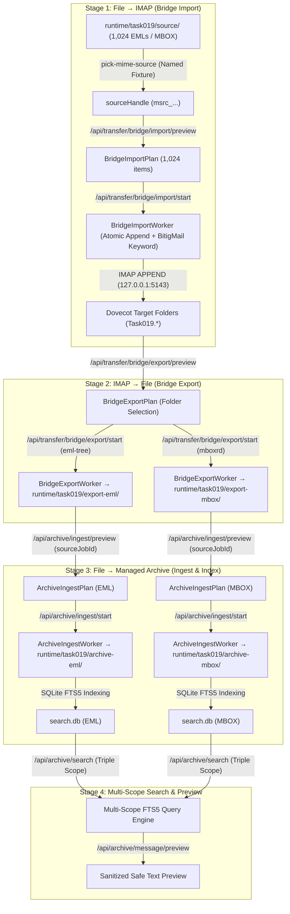

# TASK-019 Architecture Discovery Gate: Scale & Resilience Experiment Execution Design

**TASK_ID:** TASK-019  
**STATUS:** DISCOVERY COMPLETE / PENDING ROOT ACCEPTANCE  
**EXECUTOR:** GEMINI (Official Antigravity)  
**CONTROLLER:** SOL 5.6 LIMITED / ASTRA HIGH  
**SCOPE:** Read-only architecture and executable design for the staged synthetic scale (128 MiB -> conditional 1 GiB) and resilience experiment. Strictly bounded discovery only: no production, backend, frontend, dependency, service, test, or runtime fixture/data changes; no generator or test runs.

---

## 1. Executive Summary & Boundaries

Following the completion and acceptance of TASK-017 (File/Account Bridge) and TASK-018 (Local Managed Archives & SQLite FTS5 Multi-Scope Search), TASK-019 defines the executable design for the staged scale and resilience experiment authorized by [`docs/SCALE_AND_RESILIENCE_PLAN.md`](file:///C:/Users/Eddiz/Documents/ChatGPT/Mail%20Manager/docs/SCALE_AND_RESILIENCE_PLAN.md) and [`.codex-coordination/inbox/TASK-019.md`](file:///C:/Users/Eddiz/Documents/ChatGPT/Mail%20Manager/.codex-coordination/inbox/TASK-019.md).

### Core Boundaries & Constraints
1. **Bounded Discovery Only**: This phase performs code inspection, mathematical modeling, and concrete architectural design. No generator scripts are executed, no test suites are triggered, and no production or testing files are mutated.
2. **Deterministic Synthetic Data**: All corpus generation is purely synthetic, reproducible from a fixed integer seed, containing zero real/private/downloaded user mail. All email addresses reside strictly under RFC 2606 `.example` domains.
3. **Loopback Environment Preservation**: All network operations occur exclusively against the existing isolated Dovecot IMAP container on `127.0.0.1:5143`. No provider/TLS exception expansion is permitted. The original 12 baseline messages in `INBOX`, `Gönderilenler`, and `Projeler.İstanbul` are protected by pre/post-flight invariant checks; zero `DELETE`, `EXPUNGE`, or `MOVE` operations are allowed.
4. **Honest Format Distinction**: EML-tree and MBOXRD pipelines are evaluated and measured separately. An EML-tree throughput measurement cannot and will not be used to claim MBOX capability, and neither establishes PST/OST 100 GB support.
5. **Memory & Retention Accountability**: In accordance with the root preflight observation on [`BridgeExportWorker.cs`](file:///C:/Users/Eddiz/Documents/ChatGPT/Mail%20Manager/engine/BitigMail.LocalHost/Bridge/Transfer/BridgeExportWorker.cs), the whole-folder byte array retention in MBOX export is documented, its memory impact at 128 MiB is measured, and a streaming architectural refactoring is designed for root evaluation prior to any 1 GiB MBOX execution.
6. **Hardware & Resource Safety**: Strict preflight assertions enforce a minimum 10 GiB disk reserve on `C:` beyond the maximum calculated amplification footprint, plus active physical RAM thresholds.

---

## 2. Deterministic ~128 MiB (>=1000 EML) Corpus Generator Schema & Seed

### A. Seed, Sizing, and Message Distribution
- **Deterministic Seed**: `SEED = 20260914` (used to initialize a deterministic PRNG based on Python `hashlib.sha256` counter-mode / standard `random.Random(20260914)`).
- **Total Message Count**: Exactly $N = 1,024$ physical EML files ($1,024 \ge 1,000$, binary power enabling symmetric folder partitioning).
- **Target Size**: $128 \text{ MiB} = 134,217,728 \text{ bytes}$ ($\pm 1.5\%$, bounded strictly within $[127.0 \text{ MiB}, 129.5 \text{ MiB}]$).
- **Per-Message Security Limit**: Strictly $< 64 \text{ MiB}$ (the maximum raw message threshold enforced by [`ArchiveMimeParser.MaxRawMessageSizeBytes`](file:///C:/Users/Eddiz/Documents/ChatGPT/Mail%20Manager/engine/BitigMail.Engine/Archive/ArchiveMimeParser.cs#L30) is $67,108,864 \text{ bytes}$). The largest single message in the corpus is bounded at $24.0 \text{ MiB}$.

### B. Exact Folder Allocation & Partitioning
The 1,024 messages are structured across 5 distinct logical folders with authentic Turkish and hierarchical paths:

| Logical Folder | Folder Key / Disk Subpath | Message Count | Target Aggregate Size | Description / Payload Characteristics |
|---|---|---|---|---|
| `Gelen Kutusu` | `inbox` | 400 | ~48.0 MiB | High-volume operational mail; mixed text, HTML, and small receipts. |
| `Gönderilenler` | `sent` | 200 | ~24.0 MiB | Outbound correspondence; small/medium text attachments. |
| `Projeler/Anadolu` | `projects-anadolu` | 200 | ~28.0 MiB | Technical specifications, images, tables, dual duplicate pairs. |
| `Arşiv/2026/Finans` | `archive-finans` | 150 | ~20.0 MiB | Financial statements, structured tables, UTF-8 filename attachments. |
| `Müşteri İlişkileri/Talepler` | `customer-support` | 74 | ~8.0 MiB | Support tickets, long body cases, Turkish-English `I`/`İ` edge terms. |
| **Total** | **5 Folders** | **1,024** | **~128.0 MiB** | **Mean raw size: ~125.0 KiB / message** |

### C. Concrete Structural Edge Cases & Test Scenarios

```
                                  CORPUS STRUCTURAL COMPOSITION (1,024 Items)
  ┌───────────────────────────────────────────────────────────────────────────────────────────────────────┐
  │ 1. Duplicates & Identity Collisions (24 items)                                                       │
  │    - 6 exact physical byte-identical duplicate pairs (12 items, matching SHA-256 & Message-ID)        │
  │    - 4 content-duplicate pairs with distinct Message-IDs (8 items)                                    │
  │    - 2 shared Message-ID pairs with divergent body, date & SHA-256 (4 items)                          │
  ├───────────────────────────────────────────────────────────────────────────────────────────────────────┤
  │ 2. Turkish-English I & Case Folding Matrix (120 items)                                               │
  │    - "Isparta" (I) vs "İzmir" (İ) vs "ışık" (ı) vs "işlem" (i)                                       │
  │    - "Diyarbakır", "İstanbul", "Iğdır", "ılık", "ilik", "İnşaat", "SIRALAMA", "sıkıştırma"           │
  │    - Target: FTS5 folding (NormalizeSearchText: Form C + tr-TR lowercase + 'ı' -> 'i')                │
  ├───────────────────────────────────────────────────────────────────────────────────────────────────────┤
  │ 3. Unicode, Multipart & Internationalization (80 items)                                              │
  │    - Cyrillic, Greek, German umlauts, Arabic RTL phrases, emojis in Subject/Body (📁, 📎, 🚀, 🧾)     │
  │    - RFC 2047 encoded-word variations (B-encoding, Q-encoding, split lines)                          │
  ├───────────────────────────────────────────────────────────────────────────────────────────────────────┤
  │ 4. Chronological & Timezone Boundary Cases (100 items)                                                │
  │    - Dates spanning 2020-01-01 to 2026-09-14; 6 timezone offsets (+03:00, +00:00, -05:00, +09:00...) │
  │    - Leap-year boundary (2024-02-29T23:59:59Z), year roll-overs, DST shifts                          │
  │    - Missing Date header fallback (4 items, verifying INTERNALDATE inheritance)                       │
  ├───────────────────────────────────────────────────────────────────────────────────────────────────────┤
  │ 5. Attachment Spectrum (300 items with attachments)                                                  │
  │    - 150 items: UTF-8 Turkish text attachments (e.g. şartname_özeti.txt)                              │
  │    - 80 items: In-memory deterministic PNG / PDF documents (100 KiB - 2 MiB)                         │
  │    - 50 items: Multipart/related inline images with CID (e.g. <logo_cid>, verifies parser inclusion) │
  │    - 16 items: Medium-large binary payloads (4 MiB, 8 MiB, 16 MiB, max 24 MiB; all < 64 MiB limit)   │
  │    - 4 items: Multiple attachments (up to 5 distinct files per message)                              │
  ├───────────────────────────────────────────────────────────────────────────────────────────────────────┤
  │ 6. Long-Body Scalar-Safe Truncation Cases (16 items)                                                 │
  │    - 8 items: Text body exceeding 512 KiB (600 KiB to 1.5 MiB plain text)                            │
  │    - 8 items: HTML body exceeding 512 KiB (large data tables, extracted via HtmlTokenizer)           │
  │    - Verifies ArchiveMimeParser.TruncateUtf8Scalars sets isBodyTruncated = true without Rune breaks   │
  ├───────────────────────────────────────────────────────────────────────────────────────────────────────┤
  │ 7. MBOXRD Escaping Edge Cases (24 items)                                                             │
  │    - Bodies with leading "From ", ">From ", ">>From ", ">>>From " across CRLF and LF lines            │
  │    - Verifies single-character unescaping preserving raw bytes exactly in mboxrd                     │
  ├───────────────────────────────────────────────────────────────────────────────────────────────────────┤
  │ 8. Standard Operational Correspondence (360 items)                                                   │
  │    - Baseline text/HTML messages with varied lengths (2 KiB to 80 KiB)                                │
  └───────────────────────────────────────────────────────────────────────────────────────────────────────┘
```

### D. Expected Identity Manifest Schema (`manifest.json`)
The generator outputs a strict `manifest.json` at the root of `runtime/task019/source/` containing:
```json
{
  "generatorSeed": 20260914,
  "generatedAtUtc": "2026-09-14T06:00:00Z",
  "totalItems": 1024,
  "totalRawSizeBytes": 134217728,
  "aggregateFingerprint": "sha256_of_concatenated_item_fingerprints",
  "folders": {
    "Gelen Kutusu": { "itemCount": 400, "rawSizeBytes": 50331648 },
    "Gönderilenler": { "itemCount": 200, "rawSizeBytes": 25165824 },
    "Projeler/Anadolu": { "itemCount": 200, "rawSizeBytes": 29360128 },
    "Arşiv/2026/Finans": { "itemCount": 150, "rawSizeBytes": 20971520 },
    "Müşteri İlişkileri/Talepler": { "itemCount": 74, "rawSizeBytes": 8388608 }
  },
  "messages": [
    {
      "ordinal": 0,
      "relativePath": "Gelen Kutusu/msg_00000000.eml",
      "folder": "Gelen Kutusu",
      "rawSha256": "4f53cda18c2baa0c0354bb5f9a3ecbe5ed12ab4d8e11ba873c2f11161202b945",
      "rawSizeBytes": 128450,
      "messageIdHeader": "<20260914-0000@posta.example>",
      "subject": "Proje Başlangıç Bildirimi - İhale Şartnamesi",
      "senderAddress": "ahmet.yilmaz@posta.example",
      "senderDisplay": "Ahmet Yılmaz",
      "dateUtc": "2026-03-15T08:30:00Z",
      "attachmentCount": 1,
      "attachments": [
        {
          "fileName": "şartname_özeti.txt",
          "sizeBytes": 2048,
          "sha256": "e3b0c44298fc1c149afbf4c8996fb92427ae41e4649b934ca495991b7852b855",
          "isInline": false,
          "contentId": null
        }
      ],
      "isBodyTruncated": false,
      "expectedSearchMatches": ["proje", "ihale", "sartname", "ahmet"]
    }
  ],
  "searchOracles": {
    "turkishIQueries": [
      { "query": "isparta", "expectedMatchingOrdinals": [42, 105, 312] },
      { "query": "işlem", "expectedMatchingOrdinals": [12, 88, 540, 902] }
    ],
    "duplicateGroups": [
      { "groupName": "exact-pair-1", "ordinals": [40, 41], "byteIdentical": true },
      { "groupName": "shared-mid-1", "ordinals": [100, 101], "byteIdentical": false }
    ]
  }
}
```

---

## 3. Isolation & Environment Architecture: Runtime, Dovecot & Tenants

### A. Isolated `runtime/task019` Directory Layout
To guarantee zero collisions with the normal local engine (`runtime/local-engine`) or testing engine (`runtime/testing-engine`), all synthetic data, exports, managed archives, journals, and receipts are isolated under `runtime/task019/`:

```
runtime/task019/
├── source/
│   ├── eml/                                    # Generated 1,024 physical EML directory tree
│   │   ├── Gelen Kutusu/
│   │   ├── Gönderilenler/
│   │   ├── Projeler/Anadolu/
│   │   ├── Arşiv/2026/Finans/
│   │   └── Müşteri İlişkileri/Talepler/
│   ├── corpus.mbox                             # Generated ~128 MiB unified MBOX (mboxrd)
│   └── manifest.json                           # Authoritative generator manifest
├── export-eml/                                 # IMAP -> EML-tree export output (from BridgeExportWorker)
│   ├── manifest.json
│   └── ... (re-exported 1,024 EML files)
├── export-mbox/                                # IMAP -> MBOX export output (from BridgeExportWorker)
│   ├── manifest.json
│   ├── Gelen Kutusu.mbox
│   ├── Gönderilenler.mbox
│   ├── Projeler.Anadolu.mbox
│   ├── Arşiv.2026.Finans.mbox
│   └── Müşteri İlişkileri.Talepler.mbox
├── archive-eml/                                # Managed Archive ingested from EML-tree export
│   ├── manifest.json                           # Immutable archive manifest
│   ├── raw/                                    # Byte-for-byte stored raw MIME files
│   └── search.db                               # SQLite FTS5 search index (rebuildable)
├── archive-mbox/                               # Managed Archive ingested from MBOX export
│   ├── manifest.json
│   ├── raw/
│   └── search.db
├── jobs/                                       # LocalJobRecord JSONs for task019 executions
├── reports/                                    # ConversionReport JSONs
└── evidence/                                   # Process telemetry, PID memory logs & receipts
```

### B. Dovecot IMAP Loopback (`127.0.0.1:5143`) Folder Ownership
- **Connection Policy**: Strictly conforms to [`ImapConnectionPolicy.cs`](file:///C:/Users/Eddiz/Documents/ChatGPT/Mail%20Manager/engine/BitigMail.LocalHost/Security/ImapConnectionPolicy.cs#L37) (`host: "127.0.0.1"`, `port: 5143`, `tlsMode: "none"`).
- **Target Account**: `target` account from [`lab/task014/dovecot/local-credentials.json`](file:///C:/Users/Eddiz/Documents/ChatGPT/Mail%20Manager/lab/task014/dovecot/local-credentials.json).
- **Dedicated Folder Hierarchy**: All synthetic folders are created under a dedicated root namespace:
  - `Task019.GelenKutusu`
  - `Task019.Gonderilenler`
  - `Task019.Projeler.Anadolu`
  - `Task019.Arsiv.2026.Finans`
  - `Task019.MusteriIliskileri.Talepler`

### C. Invariant Verification of Original `lab12` Baseline
The original 12 messages in the Dovecot container must remain untouched throughout all phases of TASK-019.
- **Protected Folders**: `INBOX` (5 msgs), `Gönderilenler` (3 msgs), `Projeler.İstanbul` (4 msgs).
- **Preflight & Postflight Oracle Checks**:
  Before any import starts and after all experiments conclude, the runner executes a read-only IMAP audit against [`lab/task014/seed-manifest.json`](file:///C:/Users/Eddiz/Documents/ChatGPT/Mail%20Manager/lab/task014/seed-manifest.json) verifying:
  1. `INBOX`: Message count == 5, UIDs == 1..5, UIDVALIDITY == `1789298756`.
  2. `Gönderilenler`: Message count == 3, UIDs == 1..3, UIDVALIDITY == `1789298760`.
  3. `Projeler.İstanbul`: Message count == 4, UIDs == 1..4, UIDVALIDITY == `1789298760`.
  4. All 12 messages match their recorded SHA-256 byte hashes and RFC 822 `Message-ID` headers.
  5. If ANY original message, UID, flag, or validity is perturbed, the run fails immediately fail-closed.

### D. Multi-Tenant Scope Ownership
To prevent any cross-tenant leakage in catalog or search:
- `CompanyId`: `company-task019-scale`
- `ProjectId`: `project-task019-resilience`
- `CompanyName`: `TASK-019 Ölçek Laboratuvarı`
- `ProjectName`: `128MiB Dayanıklılık ve Hacim Testi`

---

## 4. End-to-End Protected API Pipeline Flow

The experiment executes the complete, real protected pipeline across all engine layers without bypassing any security or validation boundaries.



### Exact API Call Sequence

#### 1. File -> IMAP Import Stage
1. `POST /api/testing/set-mime-source` with `{"fixtureId": "task019-tree"}` (or `"task019-mbox"`).
2. `POST /api/picker/archive-source` with `{"mode": "eml-tree"}` -> returns `{ "handle": "msrc_...", "displayPath": ... }`.
3. `POST /api/transfer/bridge/source/describe` with `{"sourceHandle": "msrc_..."}` -> returns total 1,024 items, ~128 MiB.
4. `POST /api/transfer/bridge/import/preview` with `sourceHandle`, `targetAccountId`, folder mappings (`Gelen Kutusu` -> `Task019.GelenKutusu`, etc.).
5. `POST /api/transfer/bridge/import/start` with `previewId`, `idempotencyKey: uuid()`, `companyId`, `projectId`.
6. Poll `GET /api/jobs/{jobId}` until `status == "completed"`.
7. Retrieve report via `GET /api/jobs/{jobId}/report`, verifying `totalPlanned == 1024`, `totalVerified == 1024`, `totalFailed == 0`.

#### 2. IMAP -> File Export Stage (Both EML-tree and MBOXRD)
1. `POST /api/transfer/bridge/export/preview` with `sourceAccountId`, folder selection (`Task019.*`), and `targetFormat: "eml-tree"` (Run A) or `"mboxrd"` (Run B).
2. `POST /api/transfer/bridge/export/start` with `previewId`, `idempotencyKey: uuid()`, `outputDirHandle`.
3. Poll `GET /api/jobs/{jobId}` until `status == "completed"`.
4. Retrieve export report, verifying all 1,024 items verified.

#### 3. File -> Managed Archive Ingest Stage
1. `POST /api/archive/ingest/preview` with `sourceJobId: exportJob.JobId`, `archiveName: "Task019-EML-Archive"`, `companyId`, `projectId`.
2. `POST /api/archive/ingest/start` with returned `previewId` and `idempotencyKey: uuid()`.
3. Poll `GET /api/jobs/{jobId}`: Stage transitions `Arşivleniyor` (staging raw files) -> `İndeksleniyor` (SQLite FTS5 batch insert) -> `Tamamlandı`.
4. Repeat for MBOX export job: `POST /api/archive/ingest/preview` with `sourceJobId: mboxExportJob.JobId`, `archiveName: "Task019-MBOX-Archive"`.

#### 4. Search Verification & Preview Stage
1. `POST /api/archive/search` with selections:
   ```json
   {
     "selections": [
       { "companyId": "company-task019-scale", "projectId": "project-task019-resilience", "archiveId": "arc_task019_eml" }
     ],
     "query": "şartname",
     "page": 1,
     "pageSize": 50
   }
   ```
2. Verify total hit count, latency ($T_{\text{first}}$ and $T_{\text{repeated}}$), and term matching.
3. Test Turkish case folding: Query `"isparta"` and verify it returns messages containing `"Isparta"`.
4. Test message preview: `POST /api/archive/message/preview` for truncated long-body items, verifying `isBodyTruncated == true` and sanitized preview text matches without executing HTML or fetching remote links.

---

## 5. Measurement Methodology, Telemetry & Resource Reserves

### A. Exact Timing Boundaries & Durations
All timing measurements use high-resolution monotonic clocks (`time.perf_counter()` in Python / `Stopwatch.GetTimestamp()` in .NET):
- $T_0$ (**Initiation**): Timestamp immediately before sending the `POST .../start` request.
- $T_1$ (**First Item Progress**): Timestamp of the first status poll where `itemsWritten > 0` or journal shows first item `Staged`/`Verified`.
- $T_2$ (**Completion**): Timestamp of the status poll where `status == "completed"`.
- **Total Elapsed Time**: $\Delta T = T_2 - T_0$ (seconds).
- **Time to First Item**: $T_{\text{lag}} = T_1 - T_0$ (pipeline latency prior to first throughput).

### B. Precise Byte Definitions
To eliminate ambiguity in throughput reporting, all bytes are rigorously categorized:
1. **Raw Source Bytes ($B_{\text{src}}$)**: Exact sum of file lengths on disk for 1,024 EMLs, or byte length of the MBOX file.
2. **Canonical MIME Bytes ($B_{\text{mime}}$)**: Sum of canonicalized byte payloads formatted for IMAP transmission ([`BridgeMimeBytePolicy.CanonicalizeForImap`](file:///C:/Users/Eddiz/Documents/ChatGPT/Mail%20Manager/engine/BitigMail.LocalHost/Bridge/Transfer/BridgeExportWorker.cs)).
3. **Export Output Bytes ($B_{\text{out}}$)**: Byte sum of exported `.eml` files or `.mbox` files written to disk.
4. **Managed Storage Bytes ($B_{\text{archive}}$)**: Total bytes in `runtime/task019/archive-*/raw/` plus SQLite database `search.db`.

### C. Throughput Metrics
$$\text{Item Throughput} = \frac{N}{\Delta T} \quad (\text{messages / second})$$
$$\text{Data Ingestion Rate} = \frac{B_{\text{src}}}{1024 \times 1024 \times \Delta T} \quad (\text{MiB / second})$$
$$\text{Data Export Rate} = \frac{B_{\text{out}}}{1024 \times 1024 \times \Delta T} \quad (\text{MiB / second})$$

### D. Process Resource Telemetry & Sampling Interval
The runner monitors the exact `TestingHost` process by PID every $\Delta t_{\text{sample}} = 100 \text{ ms}$:
- **CPU Utilization (%)**: Calculated across sample intervals:
  $$\text{CPU \%} = \frac{\Delta \text{TotalProcessorTime}}{\Delta \text{ClockTime} \times \text{Environment.ProcessorCount}} \times 100$$
- **Working Set 64**: Physical RAM currently mapped by the OS for the process.
- **Peak Working Set 64**: Maximum physical RAM observed by the OS over process lifetime.
- **Private Memory Size 64**: Total committed virtual memory dedicated to the process.
- **Baseline Memory Accounting**: The runner records memory immediately before job launch ($M_{\text{base}}$), computes net delta $\Delta M = M_{\text{peak}} - M_{\text{base}}$, and restarts TestingHost between distinct benchmark runs to reset peak counters.

#### Disclosure of Sampling Window Limitations
A polling interval of $100 \text{ ms}$ captures sustained memory pressure but cannot detect instantaneous transient allocations (e.g. temporary byte buffers allocated in Gen 0 / Gen 1 and collected between samples). Therefore, peak working set represents the maximum sampled working set, not an absolute theoretical allocation ceiling.

### E. Disk & RAM Preflight Rules, Amplification Matrix & 10 GiB Reserve
Every stage verifies disk and RAM immediately before executing:

```
                            STORAGE AMPLIFICATION BREAKDOWN (128 MiB Run)
  ┌──────────────────────────────────────────────┬───────────────┬────────────────────────────────────────┐
  │ Component                                    │ Disk Footprint│ Note                                   │
  ├──────────────────────────────────────────────┼───────────────┼────────────────────────────────────────┤
  │ 1. Synthetic Source EMLs                     │ ~128 MiB      │ runtime/task019/source/eml/            │
  │ 2. Synthetic Source MBOX                     │ ~128 MiB      │ runtime/task019/source/corpus.mbox     │
  │ 3. Staging during Export                     │ ~128 MiB      │ Temporary staging in .staging/         │
  │ 4. Exported EML Tree                         │ ~128 MiB      │ runtime/task019/export-eml/            │
  │ 5. Exported MBOX Files                       │ ~128 MiB      │ runtime/task019/export-mbox/           │
  │ 6. Dovecot Docker Volume (/mail)             │ ~135 MiB      │ Maildir + dovecot.index + cache        │
  │ 7. Managed Archive Raw MIME (EML + MBOX)     │ ~256 MiB      │ runtime/task019/archive-*/raw/         │
  │ 8. SQLite FTS5 Index Databases (search.db)   │ ~80 MiB       │ Token index + unicode61 FTS5 tables    │
  │ 9. Journals, Logs & Job Records              │ ~15 MiB       │ JSON reports and durable journals      │
  ├──────────────────────────────────────────────┼───────────────┼────────────────────────────────────────┤
  │ Total Footprint (128 MiB multi-stage run)    │ ~1,127 MiB    │ Amplification Factor: ~8.8x (all runs) │
  │ Single Pipeline Footprint (1 format)         │ ~650 MiB      │ Amplification Factor: ~5.1x (single)   │
  └──────────────────────────────────────────────┴───────────────┴────────────────────────────────────────┘
```

#### The 10 GiB Hard Reserve Rule
- Current free space on `C:` (measured during discovery): $\approx 150.1 \text{ GiB}$.
- **128 MiB Preflight Rule**: Requires $\text{FreeDisk} \ge 1.2 \text{ GiB} + 10.0 \text{ GiB} = 11.2 \text{ GiB}$.
- **Conditional 1 GiB Preflight Rule**: Calculated amplification for 1 GiB full run $\approx 8.8 \text{ GiB}$. Requires $\text{FreeDisk} \ge 8.8 \text{ GiB} + 10.0 \text{ GiB} = 18.8 \text{ GiB}$.
- **RAM Preflight Rule**: Requires available physical RAM $\ge 2.0 \text{ GiB}$ for 128 MiB stage, and $\ge 8.0 \text{ GiB}$ for conditional 1 GiB stage.
- If available disk or RAM violates these boundaries at preflight time, execution halts immediately with an explicit preflight error.

---

## 6. Resilience, Fault Injection & Process Recovery Design

### A. Strict TestingHost Process Ownership & Termination Rules
To prevent any accidental interference with user processes, browsers, Outlook, or Docker containers:
1. **PID Registry**: TestingHost writes its current PID to `Path.Combine(runtimeDir, "testinghost.pid")` immediately after binding port 6175 ([`BitigMail.TestingHost/Program.cs#L84-L95`](file:///C:/Users/Eddiz/Documents/ChatGPT/Mail%20Manager/engine/BitigMail.TestingHost/Program.cs#L84-L95)).
2. **Three-Point Verification Before Termination**:
   The runner reads `testinghost.pid`, resolves the process handle, and asserts:
   - `process.ProcessName` is `BitigMail.TestingHost` (or `dotnet`).
   - `process.MainModule.FileName` resides within the workspace repository under `engine/BitigMail.TestingHost`.
   - The process is verified listening on `127.0.0.1:6175`.
3. **Fail-Closed Abort**: If any check fails, termination is aborted immediately. Wildcard kills (`taskkill /F /IM ...`) are strictly prohibited.
4. **Hidden Background Restart**: When the runner restarts TestingHost, it uses `ProcessStartInfo` with `CreateNoWindow = true`, `WindowStyle = ProcessWindowStyle.Hidden`, and `UseShellExecute = false`, then polls `GET /api/session` until HTTP 200 is received.

### B. Fault Injection Seams & Recovery Scenarios

#### Seam 1: Mid-Stream Hard Process Crash & Startup Reconciliation
- **Injection Mechanism**:
  1. Runner arms fault via `POST /api/testing/bridge-fault` with `{"fault": "PauseAfterAppendBeforeReturn", "targetOrdinal": 500}`.
  2. Bridge import job begins processing 1,024 items.
  3. At item 500, [`TestingBridgeFaultService.WriteSignal`](file:///C:/Users/Eddiz/Documents/ChatGPT/Mail%20Manager/engine/BitigMail.TestingHost/TestingBridgeFaults.cs#L60) writes `bridge-pause.signal`.
  4. The runner detects the signal file, verifies that job status is active with ~500 items processed, and executes a hard kill (`process.Kill()`).
- **Recovery Verification**:
  1. Runner relaunches TestingHost in the background.
  2. TestingHost executes [`JobManager.RecoverInterruptedJobsOnStartup()`](file:///C:/Users/Eddiz/Documents/ChatGPT/Mail%20Manager/engine/BitigMail.LocalHost/Jobs/JobManager.cs#L91-L153), transitions the job to `status: "interrupted"`.
  3. Runner issues `POST /api/transfer/bridge/import/resume/{jobId}`.
  4. The worker re-validates the source manifest against the frozen plan, inspects the durable journal, verifies items 1..500 are already verified in target Dovecot, and seamlessly resumes appending from item 501.
  5. Upon completion, the runner verifies: total verified == 1,024, failed == 0, duplicate messages in Dovecot == 0.

#### Seam 2: Controlled Network / IMAP Drop During Append
- **Injection Mechanism**:
  1. Runner arms fault via `POST /api/testing/bridge-fault` with `{"fault": "LostResponseAfterAppend", "targetOrdinal": 250}`.
  2. At item 250, [`TestingFaultTransferClient.AppendMessageAsync`](file:///C:/Users/Eddiz/Documents/ChatGPT/Mail%20Manager/engine/BitigMail.TestingHost/TestingBridgeFaults.cs#L160-L177) successfully delivers the message to Dovecot with a unique 128-bit `BitigMailKeyword` stamped in the header, then immediately aborts the TCP socket before receiving the IMAP `OK` response.
  3. The worker records an exception; the journal entry for item 250 remains in `AppendIntent` with the stamped keyword saved.
- **Recovery Verification**:
  1. Runner triggers job resume via `POST /api/transfer/bridge/import/resume/{jobId}`.
  2. Worker encounters `AppendIntent` state for item 250, performs [`targetClient.SearchByKeywordAsync(folder, keyword)`](file:///C:/Users/Eddiz/Documents/ChatGPT/Mail%20Manager/engine/BitigMail.LocalHost/Bridge/Transfer/BridgeImportWorker.cs#L400), finds the exact UID of the appended message, validates its SHA-256 hash against `CanonicalSha256`, reconciles without re-appending, marks item 250 `Verified`, and continues to item 251.
  3. Proves zero duplicate messages created despite network disconnect.

#### Seam 3: Controlled Disk Write Failure & Atomic Staging Rollback
- **Injection Mechanism**:
  1. During archive ingestion or bridge export, inject a temporary file lock or write permission denial on a staging path.
  2. Worker encounters `IOException`.
  3. Verify that atomic temporary files (`.tmp`) are cleanly removed in `finally` blocks, partial output files are unlinked, and the durable journal records the failure without leaving dangling partial data.

---

## 7. Root Preflight MBOX Retention Observation & Architecture Remediation

### A. Deep Code Inspection of `BridgeExportWorker.cs`
In [`BridgeExportWorker.cs` lines 234–343](file:///C:/Users/Eddiz/Documents/ChatGPT/Mail%20Manager/engine/BitigMail.LocalHost/Bridge/Transfer/BridgeExportWorker.cs#L234-L343), the MBOXRD export pipeline executes as follows:

```csharp
// Line 235:
var stagedEntries = new List<(BridgeExportPlannedItem Item, string StagedPath, byte[] RawBytes)>();

foreach (var item in folderGroup)
{
    // ... fetches or reads single message into byte[] rawBytes ...
    // Writes rawBytes to stagedPath on disk (msg_{uid}.raw)
    stagedEntries.Add((item, stagedPath, rawBytes)); // <-- RETAINS byte[] in memory!
}

// Line 306:
using (var mboxFs = new FileStream(tempMboxPath, FileMode.CreateNew, FileAccess.Write, FileShare.None))
{
    foreach (var (item, _, rawBytes) in stagedEntries)
    {
        // Writes MBOX record from in-memory rawBytes
        var recordInfo = BridgeMimeBytePolicy.WriteMboxrdRecord(mboxFs, rawBytes, envelopeDate);
        // ... updates journal ...
    }
    mboxFs.Flush(true);
}
```

### B. Analytical Breakdown of the Bottleneck
1. **Redundant Dual Storage**: Each downloaded message is already saved durably to disk at `stagedPath` (`.staging/{folderKey}/msg_{uid}.raw`). Holding `rawBytes` in `stagedEntries` means the message payload exists **both on disk and in memory simultaneously**.
2. **Memory Accumulation**: For a folder containing $M$ messages totaling $S$ bytes, the `stagedEntries` list retains $S$ bytes of managed `byte[]` arrays concurrently.
   - Any message whose raw byte array exceeds 85,000 bytes is allocated on the **Large Object Heap (LOH)**.
   - LOH allocations are collected only during full Gen 2 garbage collections, inducing heap fragmentation and memory retention that persists long after the folder finishes.
3. **128 MiB Scale Impact**:
   - In our 5-folder corpus, the largest folder (`Gelen Kutusu`) is ~50 MiB.
   - Peak memory in `stagedEntries` for that folder will reach ~50 MiB + LOH overhead ($\approx 70\text{--}90 \text{ MiB}$ private bytes).
   - If tested with a single massive folder of 128 MiB, `stagedEntries` will retain the full 128 MiB in memory at once.
4. **1 GiB Catastrophic Risk**:
   - At 1 GiB scale, a single folder could hold up to 1 GiB of byte arrays simultaneously in memory.
   - In 32-bit processes or constrained memory environments, this risks immediate `OutOfMemoryException` or prolonged GC pauses exceeding 10–30 seconds.

### C. Honest Measurement Strategy for 128 MiB
The 128 MiB experiment will measure the current implementation honestly without code alterations:
1. **Partitioned Folder Run**: Measure export across the 5 folders (max ~50 MiB in memory).
2. **Single-Folder Stress Run**: Measure export of 128 MiB into a single folder (`Task019.Bulk`).
3. **Telemetry Capture**: Record exact peak working set, private bytes, and Gen 2 GC counts during Phase 2 MBOX assembly.
4. **EML vs MBOX Comparison**: Compare the memory curve of EML export (which streams message by message with peak memory $< 5 \text{ MiB}$) against MBOX export (which shows sawtooth steps corresponding to folder byte retention).

### D. Proposed Concrete Architecture Refactoring (For Root Decision, Unimplemented)
To enable true streaming for the conditional 1 GiB MBOX stage, the architecture must transition from in-memory buffering to sequential disk streaming:

```csharp
// PROPOSED STREAMING ARCHITECTURE (Specification only — not implemented in discovery):
// 1. Stage only metadata and disk paths in memory:
var stagedEntries = new List<(BridgeExportPlannedItem Item, string StagedPath)>();

foreach (var item in folderGroup)
{
    // Write downloaded raw bytes directly to stagedPath file stream; do NOT retain byte[]
    stagedEntries.Add((item, stagedPath));
}

// 2. Assemble MBOX by streaming each staged file sequentially from disk:
using (var mboxFs = new FileStream(tempMboxPath, FileMode.CreateNew, FileAccess.Write, FileShare.None, 65536))
{
    foreach (var (item, stagedPath) in stagedEntries)
    {
        ct.ThrowIfCancellationRequested();
        DateTimeOffset envelopeDate = item.OriginalMimeDateUtc ?? item.InternalDateUtc;
        
        // Stream from disk using a reusable small 64 KiB buffer:
        using (var stagedFs = new FileStream(stagedPath, FileMode.Open, FileAccess.Read, FileShare.Read, 65536))
        {
            var recordInfo = BridgeMimeBytePolicy.WriteMboxrdRecordFromStream(mboxFs, stagedFs, envelopeDate);
            // update journal ...
        }
    }
    mboxFs.Flush(true);
}
```
**Impact of Streaming Refactor**: Peak memory drops from $O(\text{FolderSize})$ to $O(\text{SingleMessageBufferSize})$ ($\approx 64 \text{ KiB}$), completely eliminating the LOH bottleneck and enabling arbitrary MBOX sizes (1 GiB, 10 GiB, etc.).

---

## 8. Exact Files to Add & TestingHost Fixture Seam Evaluation

### A. Concrete New Files to Add in Phase 2
All new experiment code is placed in isolated scripts and fixtures without modifying any existing production files:

| File Path | Role | Description |
|---|---|---|
| `lab/task019/scripts/generate_task019_corpus.py` | Generator | Deterministic Python generator using standard library only (`email`, `hashlib`, `zlib`, `struct`). Emits 1,024 EMLs (~128 MiB), `corpus.mbox`, and `manifest.json`. |
| `lab/task019/scripts/run_task019_scale_pipeline.py` | Runner | Drives end-to-end pipeline via protected HTTP API on port 6175. Manages process lifecycle, telemetry logging, fault injection, and resume verification. |
| `lab/task019/scripts/verify_task019_oracle.py` | Independent Oracle | Direct read-only IMAP audit on port 5143, raw byte validation, invariant audit of original lab12, and SQLite FTS5 database checks. |
| `docs/SCALE_AND_RESILIENCE_VALIDATION.md` | Evidence Report | Authoritative validation document containing exact timing logs, memory curves, throughput figures, and verification receipts. |
| `.codex-coordination/results/TASK-019.md` | Coordination Result | Final coordination summary linking all evidence. |

### B. Evaluation of `TestingFilePickerService.cs`: Why Bounded Named Fixtures are Necessary
[`TestingFilePickerService.cs`](file:///C:/Users/Eddiz/Documents/ChatGPT/Mail%20Manager/engine/BitigMail.TestingHost/TestingFilePickerService.cs) enforces security rule:
```csharp
// Lines 206-214:
if (trimmed.Contains('/') || trimmed.Contains('\\') || trimmed.Contains("..") || trimmed.Contains(':') ||
    Path.IsPathRooted(trimmed) || trimmed.EndsWith(".eml") || trimmed.EndsWith(".mbox"))
{
    error = "Doğrudan dosya yolu, göreceli yol veya dosya adı ile fixture seçimi yapılamaz. Yalnızca kapalı izin listesindeki fixture kimlikleri kabul edilir.";
    return false;
}
```
- **The Closed Whitelist**: TestingHost strictly rejects any arbitrary file or directory path, accepting only predefined fixture identifiers (`corpus-eml`, `corpus-tree`, `corpus-mbox`, `bridge-over50`, etc.).
- **The Protected API Requirement**: In the protected UI and API flow, initiating a bridge import requires a valid `sourceHandle` (`msrc_<guid>`). A `sourceHandle` can only be generated through `IFilePickerService.PickMimeSourceAsync()`, which in testing mode delegates to `TestingFilePickerService`.
- **Conclusion**: A bounded named fixture extension in `TestingFilePickerService.cs` is **strictly necessary** to permit TestingHost to resolve the 128 MiB synthetic corpus without compromising security.
- **Exact Proposed Whitelist Extension (Bounded & Safe)**:
  ```csharp
  case "task019-tree":
  case "task019_tree":
  {
      string dir = Path.Combine(repoRoot, "runtime", "task019", "source", "eml");
      if (!Directory.Exists(dir)) return Task.FromResult(new FilePickResult { Cancelled = false, Error = $"TASK019 EML dizini bulunamadı: {dir}" });
      manifest = BuildEmlDir(dir);
      displayPath = "task019-tree (128MiB 1024 EMLs)";
      break;
  }
  case "task019-mbox":
  case "task019_mbox":
  {
      string mbox = Path.Combine(repoRoot, "runtime", "task019", "source", "corpus.mbox");
      if (!File.Exists(mbox)) return Task.FromResult(new FilePickResult { Cancelled = false, Error = $"TASK019 MBOX dosyası bulunamadı: {mbox}" });
      manifest = BuildMbox(mbox, "task019");
      displayPath = "task019-mbox (128MiB)";
      break;
  }
  ```
  This introduces **zero arbitrary path APIs**, preserves the closed whitelist paradigm, and maintains production parity. Note that for export-to-archive, `job:<jobId>` already exists and works without any code changes.

---

## 9. Go / No-Go Gates for Conditional 1 GiB Stage & Format-Specific Claims

### A. Formal 6-Point Go/No-Go Decision Matrix
Proceeding to the conditional 1 GiB stage requires meeting ALL of the following criteria in the 128 MiB run:

| # | Gate | Threshold / Condition | Action if Failed |
|---|---|---|---|
| **1** | **Fidelity Gate** | 100% of 1,024 messages must round-trip through File->IMAP->File->Archive with zero byte corruption, zero dropped items, and zero unintended duplicates. | **HARD NO-GO**: Halt, diagnose serialization/MIME defect, report to root. |
| **2** | **Durability Gate** | Mid-stream process crash (ordinal 500) and network disconnect (ordinal 250) must resume to 100% verified status in the same job with zero duplicate messages. | **HARD NO-GO**: Halt, investigate journal state machine failure. |
| **3** | **Memory & Retention Gate** | 128 MiB EML export peak working set must remain $< 500 \text{ MiB}$. MBOX export peak memory must be characterized and reported. | If MBOX memory spikes linearly to folder size, **MBOX 1 GiB is NO-GO** pending streaming refactor; EML 1 GiB may proceed conditionally. |
| **4** | **Disk Reserve Gate** | Immediate preflight check before 1 GiB allocation must confirm $\ge 18.8 \text{ GiB}$ free disk space on `C:` ($8.8 \text{ GiB}$ estimated footprint + $10.0 \text{ GiB}$ hard user reserve). | **HARD NO-GO**: Halt immediately. Never generate 1 GiB if disk reserve is threatened. |
| **5** | **Search Performance Gate** | SQLite FTS5 multi-scope search across 1,024 items must achieve $T_{\text{first}} < 500 \text{ ms}$ and $T_{\text{repeated}} < 50 \text{ ms}$. Preview fetch must be $< 100 \text{ ms}$. | **NO-GO**: Optimize FTS5 index schema or page size before 1 GiB. |
| **6** | **Architecture Decision Gate** | Root must explicitly approve the architecture plan for MBOX (whether to execute MBOX at 1 GiB under streaming refactor or gate 1 GiB to EML-tree only). | **WAIT**: Await root architectural directive. |

### B. Explicit Format-Specific Claims & Disclaimers
The validation report will make clear, bounded, format-specific assertions:
1. **EML vs MBOX Independence**: Measurements for EML-tree throughput do not establish MBOXRD streaming or performance. Each format is tested and reported independently.
2. **PST / OST Exclusion**: This experiment does NOT establish 100 GB PST/OST support, OST conversion capability, or corrupted archive repair. The Aspose evaluation limit (50 items) remains active and unmodified. PST/OST enterprise scale remains a separate production milestone.
3. **Provider Scope**: Loopback Dovecot testing does NOT establish Microsoft 365 Graph or Google Workspace IMAP provider support. Live provider validation remains deferred to the separate personal Outlook pilot.

---

## 10. Blockers & Decisions for ASTRA / Root

The following items are submitted to ASTRA HIGH / root for decision prior to Phase 2 execution:

1. **Decision on TestingHost Fixture Extension**: Confirm authorization to add the bounded named fixture IDs (`task019-tree` and `task019-mbox`) to [`TestingFilePickerService.cs`](file:///C:/Users/Eddiz/Documents/ChatGPT/Mail%20Manager/engine/BitigMail.TestingHost/TestingFilePickerService.cs).
2. **Decision on MBOX 128 MiB vs 1 GiB Strategy**: Confirm the proposed dual-run strategy for 128 MiB (measuring the current buffered implementation honestly), followed by a root decision gate on whether to implement streaming MBOX assembly before attempting 1 GiB.
3. **Confirmation of Dovecot Target Namespace**: Confirm that `Task019.*` folders under the existing `target` account on `127.0.0.1:5143` are the approved isolated IMAP target.
4. **Phase 2 Authorization**: Upon acceptance of this discovery document, authorize the creation of `lab/task019/scripts/generate_task019_corpus.py` and associated runner/oracle scripts.
