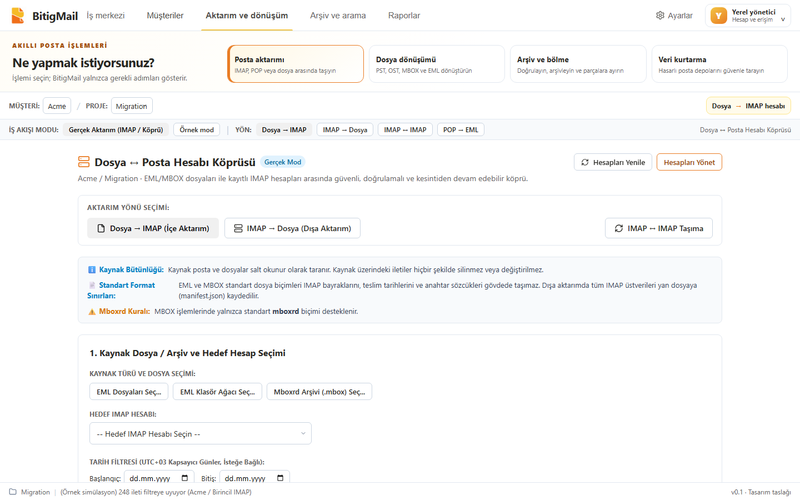
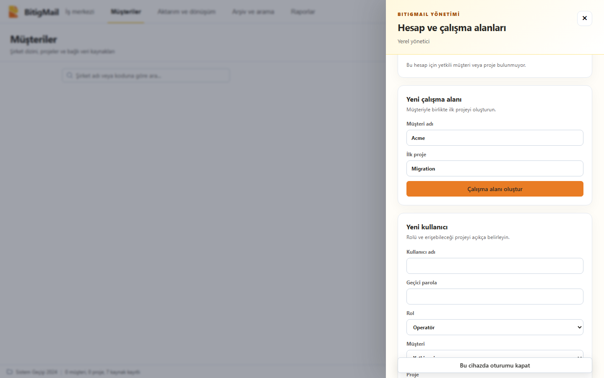

<div align="center">


# BitigMail

**Kurumsal posta yönetim platformu**

Taşı · Dönüştür · Arşivle · Kurtar


</div>

BitigMail, müşteri şirketlere hizmet veren BT firmaları için geliştirilen bir Windows uygulamasıdır. Posta dosyaları (PST, OST, EML, MBOX, OLM, Apple Mail) ile posta hesapları (IMAP, POP, Microsoft 365, Google) arasında filtreli aktarım, dönüştürme, arşivleme, arama ve kurtarma işlerini tek yerden yönetir.

Uygulama tamamen yerel çalışır: postalarınız bilgisayarınızdan çıkıp bir ara sunucuya gitmez.



## Neler yapar?

| İş | Açıklama |
|---|---|
| **Posta aktarımı** | IMAP hesapları arasında, dosyadan hesaba ve hesaptan dosyaya kopyalama. Klasör eşleme, filtre, önizleme ve kesintiden devam. |
| **Dosya dönüşümü** | OST → PST, EML/MBOX → PST, PST/OST/OLM/Apple Mail → EML. |
| **Arşiv ve bölme** | Büyük PST/OST dosyalarını yıla veya boyuta göre parçalara ayırma. Yönetilen yerel arşiv ve birden fazla şirket/proje üzerinde arama. |
| **Veri kurtarma** | Hasarlı PST/OST dosyalarının okunabilen kısmını EML olarak çıkarma; kurtarılan, kısmi ve okunamayan öğeler ayrı raporlanır. |
| **Müşteri ve proje yönetimi** | Şirket → proje → posta kaynağı düzeni; yönetici ve operatör rolleri, proje bazlı yetki. |

Her kaynak → hedef yönü ayrı uygulanır ve ayrı doğrulanır; "her formatı her formata çevirir" iddiası yoktur. Tam kapsam: [format ve yön matrisi](docs/FORMAT_DIRECTION_MATRIX.md).

## Temel ilkeler

- **Kaynak korunur.** Kaynak dosya ve posta kutuları salt okunur taranır; sunucuda silme komutu kullanılmaz.
- **Önce önizleme.** Her iş, kapsamı ve filtreleri sabitleyen bir önizleme planıyla başlar; seçim değişirse önizleme yenilenir.
- **Dosya oluşması başarı sayılmaz.** Çıktılar yeniden açılıp özet (hash), ileti ve ek sayılarıyla doğrulanır; sonuç kalıcı bir rapora yazılır.
- **Mevcut hedefin üzerine yazılmaz.**
- **Sırlar yerelde korunur.** Posta parolaları ve OAuth belirteçleri Windows DPAPI ile şifrelenir; varsayılan bağlantı SSL/TLS'dir.



## Kurulum

> [!WARNING]
> 0.9.3 **imzasız bir iç test sürümüdür**. Windows yayıncıyı doğrulayamaz. Önce içeriğini bildiğiniz küçük bir test kaynağıyla deneyin.

Gereksinim: Windows 10/11 (x64) ve Microsoft Edge WebView2 çalışma zamanı. Ayrı .NET veya Node kurulumu gerekmez.

1. [Sürümler](../../releases) sayfasından `BitigMail-Internal-0.9.3.zip` dosyasını indirip bir klasöre açın.
2. Açtığınız klasörde PowerShell ile kurun:

   ```powershell
   .\BitigMail.Setup.exe install --package . --allow-unsigned-internal
   ```

3. Başlatın:

   ```powershell
   .\BitigMail.Setup.exe launch
   ```

İlk açılışta kendi yönetici kullanıcınızı oluşturursunuz. Pencerenin kapatma düğmesi uygulamayı sistem tepsisine indirir; tamamen çıkmak için tepsi simgesinden **Çıkış** seçin. Güncelleme, geri dönüş ve kaldırma: [Windows hızlı başlangıç](docs/WINDOWS_QUICK_START_TR.md).

## Durum ve bilinen sınırlar

Sürüm 0.9.3'te yerel kabul testleri geçti (21 Eylül 2026: 892 motor testi, 151 arayüz testi). Ticari 1.0 için açık kalanlar:

- Kod imzalama sertifikası ve temiz bir Windows kurulumunda kabul testi yok.
- Aspose.Email **deneme lisansıyla** çalışıyor: PST çıktılarında değerlendirme işaretleri bulunur ve klasör başına 50 öğeyi aşan PST/OST kaynakları engellenir.
- 10–100 GB ölçeğinde ve gerçek hasarlı dosyalarla kabul yapılmadı.
- Microsoft 365, Outlook.com ve Google bağlantıları yerel olarak hazır; gerçek hesaplarla canlı pilot henüz yapılmadı.
- MBOX yalnızca **mboxrd** biçiminde kabul edilir.

Ayrıntılar: [yol haritası](docs/FULL_RELEASE_ROADMAP.md) · [Windows sürüm kabulü](docs/WINDOWS_RELEASE_ACCEPTANCE.md)

## Mimari

```text
BitigMail.Setup      kurulum, güncelleme, geri dönüş, başlatıcı
└─ BitigMail.Desktop      Windows kabuğu (WinForms + WebView2)
   └─ BitigMail.LocalHost     yerel API, kimlik/yetki, iş kuyruğu
      ├─ React arayüzü            (prototype/)
      ├─ BitigMail.Engine         formatlar, MIME, arşiv, SQLite FTS5 arama
      └─ BitigMail.RecoveryWorker hasarlı dosya okuma için yalıtılmış süreç
```

| Klasör | İçerik |
|---|---|
| `prototype/` | React 18 + TypeScript + Vite arayüzü (adı "prototype" olsa da ürünün gerçek arayüzü) |
| `engine/` | .NET 8 motoru, yerel servis, masaüstü kabuğu, kurulum ve testler |
| `docs/` | Ürün, iş akışı, kabul ve tasarım belgeleri |
| `fixtures/`, `lab/` | Sentetik test verileri ve deneyler |
| `scripts/` | Derleme ve geliştirme yardımcıları |

## Geliştirme

```powershell
# Arayüz
cd prototype
npm install
npm run dev

# Yerel motor (proje kökünden)
.\scripts\start-local-engine.ps1

# Testler
& .\.tools\dotnet\dotnet.exe test engine/BitigMail.Engine.Tests/BitigMail.Engine.Tests.csproj -c Release
cd prototype; npm run test; npm run test:e2e
```

Ayrıntılı geliştirici notları: [docs/DEVELOPER_GUIDE.md](docs/DEVELOPER_GUIDE.md). Devir ve mimari özeti: [CLAUDE_PROJECT_HANDOFF_TR.md](CLAUDE_PROJECT_HANDOFF_TR.md).

## Adı nereden geliyor?

**Bitig**, eski Türkçede yazı, mektup ve belge anlamına gelir. BitigMail bu kökü "Mail" ile birleştirir.

## Lisans

Bu depo için henüz bir açık kaynak lisansı belirlenmedi; tüm hakları saklıdır. Kullanılan üçüncü taraf bileşenler: [THIRD-PARTY-NOTICES.md](THIRD-PARTY-NOTICES.md).
