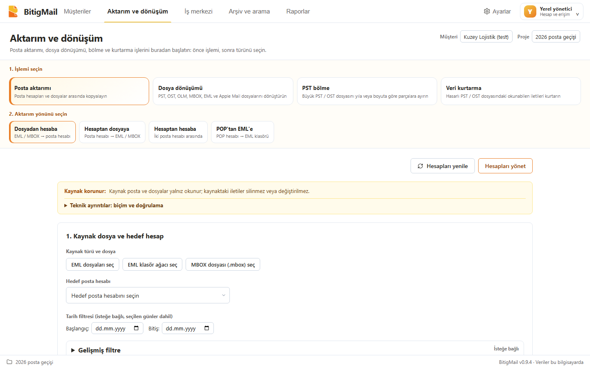
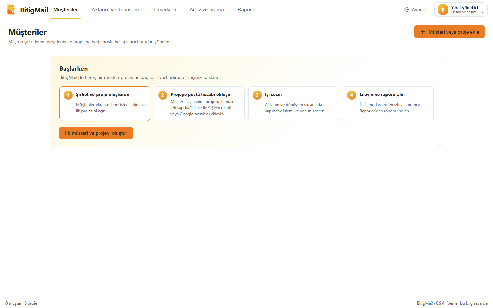

<div align="center">


# BitigMail

**Kurumsal posta yönetim platformu**

Taşı · Dönüştür · Arşivle · Kurtar


</div>

BitigMail, müşteri şirketlere hizmet veren BT firmaları için geliştirilen bir Windows uygulamasıdır. Posta dosyaları (PST, OST, EML, MBOX, OLM, Apple Mail) ile posta hesapları (IMAP, POP, Microsoft 365, Google) arasında filtreli aktarım, dönüştürme, arşivleme, arama ve kurtarma işlerini tek yerden yönetir.

Uygulama tamamen yerel çalışır: postalarınız bilgisayarınızdan çıkıp bir ara sunucuya gitmez.



**Resimli kullanım rehberi:** [docs/KULLANIM_REHBERI.md](docs/KULLANIM_REHBERI.md) — kurulum, her ekranın ne yaptığı ve bilinen sınırlar.

## Neler yapar?

Üst menü iş sırasını izler: **Müşteriler → Aktarım ve dönüşüm → İş merkezi → Arşiv ve arama → Raporlar**.

| Menü | Ne yapar |
|---|---|
| **Müşteriler** | Şirket → proje → posta hesabı düzeni. Hesaplar projeye bağlanır (IMAP; Microsoft ve Google bağlantıları). Yönetici ve operatör rolleri, proje bazlı yetki. |
| **Aktarım ve dönüşüm → Posta aktarımı** | Dosyadan hesaba (EML/MBOX → IMAP), hesaptan dosyaya (IMAP → EML/MBOX), hesaptan hesaba (IMAP kopyalama), POP'tan EML'e. Klasör eşleme, filtre, önizleme, desteklenen akışlarda kesintiden devam. |
| **Aktarım ve dönüşüm → Dosya dönüşümü** | OST → PST, EML/MBOX → PST, PST/OST/OLM → EML, Apple Mail EMLX → EML. |
| **Aktarım ve dönüşüm → PST bölme** | Büyük PST/OST dosyasını yıla veya boyuta göre yeni PST parçalarına ayırma. |
| **Aktarım ve dönüşüm → Veri kurtarma** | Hasarlı PST/OST'tan okunabilen iletileri yeni bir EML klasörüne çıkarma; kurtarılan, kısmi ve okunamayan sonuçlar ayrı raporlanır. |
| **İş merkezi** | Çalışan, sıradaki ve biten işler; duraklat/devam, kesilen işe devam, bekleyenlerin önceliği. Aynı anda 1 iş çalışır, 32'ye kadar iş bekler. |
| **Arşiv ve arama** | Yerel yönetilen arşiv; birden çok müşteri/proje/arşivde birlikte arama, seçili sonuçları EML olarak dışa aktarma; yedekleme, geri yükleme, saklama önizlemesi ve denetim. |
| **Raporlar** | Tamamlanan işlerin doğrulama raporu (JSON). |

Her kaynak → hedef yönü ayrı uygulanır ve ayrı doğrulanır; "her formatı her formata çevirir" iddiası yoktur. Tam kapsam: [format ve yön matrisi](docs/FORMAT_DIRECTION_MATRIX.md).

## Temel ilkeler

- **Kaynak korunur.** Kaynak dosya ve posta kutuları salt okunur taranır; sunucuda silme komutu kullanılmaz.
- **Önce önizleme.** Her iş, kapsamı ve filtreleri sabitleyen bir önizleme planıyla başlar; seçim değişirse önizleme yenilenir.
- **Dosya oluşması başarı sayılmaz.** Çıktılar yeniden açılıp özet (hash), ileti ve ek sayılarıyla doğrulanır; sonuç kalıcı bir rapora yazılır.
- **Mevcut hedefin üzerine yazılmaz.**
- **Sırlar yerelde korunur.** Posta parolaları ve OAuth belirteçleri Windows DPAPI ile şifrelenir. Bağlantı varsayılanı SSL/TLS; STARTTLS seçilebilir; şifresiz bağlantı yalnız hesap bazında açık onayla.



## Kurulum

> [!WARNING]
> 0.9.4 **imzasız bir iç test sürümüdür**. Windows yayıncıyı doğrulayamaz. Önce içeriğini bildiğiniz küçük bir test kaynağıyla deneyin.

Gereksinim: Windows 10/11 (x64) ve Microsoft Edge WebView2 çalışma zamanı. Ayrı .NET veya Node kurulumu gerekmez.

1. [Sürümler](../../releases) sayfasından `BitigMail-Internal-0.9.4.zip` dosyasını indirip bir klasöre açın.
2. Açtığınız klasörde PowerShell ile kurun:

   ```powershell
   .\BitigMail.Setup.exe install --package . --allow-unsigned-internal
   ```

3. Başlatın:

   ```powershell
   .\BitigMail.Setup.exe launch
   ```

İlk açılışta kendi yönetici kullanıcınızı oluşturursunuz; ardından Müşteriler ekranındaki dört adımlık "Başlarken" kartı ilk işe kadar yol gösterir. Pencerenin kapatma düğmesi uygulamayı sistem tepsisine indirir; tamamen çıkmak için tepsi simgesinden **Çıkış** seçin. Güncellemeden önce tepsiden **Çıkış** ile kapatın. Güncelleme aynı `install` komutuyla yapılır; geri dönüş `rollback`, kaldırma (kullanıcı verisi korunur) `uninstall`. Ayrıntı: [kullanım rehberi](docs/KULLANIM_REHBERI.md#kurulum) · [Windows hızlı başlangıç](docs/WINDOWS_QUICK_START_TR.md).

## Durum ve bilinen sınırlar

Sürüm 0.9.4 bir arayüz sürümüdür: menüler iş sırasına dizildi, aktarım ekranı üç adıma indi (işlemi seç → türünü seç → yalnız o akışın adımları), boş kurulumda "Başlarken" kartı geldi, oturum açılmış uygulamada örnek kayıt kalmadı. 0.9.3'te oturum açıkken OST → PST, PST bölme ve EML/MBOX → PST ekranlarının motoru yanlışlıkla "çevrimdışı" görmesi düzeltildi.

Son tarihli tam kabul kaydı 0.9.3'e aittir (21 Eylül 2026: 892 motor testi, 151 arayüz testi; [Windows sürüm kabulü](docs/WINDOWS_RELEASE_ACCEPTANCE.md)). Ticari 1.0 için açık kalanlar:

- Kod imzalama sertifikası ve temiz bir Windows kurulumunda kabul testi yok.
- Aspose.Email **deneme lisansıyla** çalışıyor: PST çıktılarında değerlendirme işaretleri bulunur ve klasör başına 50 öğeyi aşan PST/OST kaynakları engellenir (IMAP aktarımında bu sınır yok).
- 10–100 GB ölçeğinde ve gerçek hasarlı dosyalarla kabul yapılmadı (en büyük test yaklaşık 1 GiB; kurtarma küçük, kontrollü hasarlarla doğrulandı).
- Microsoft 365, Outlook.com ve Google bağlantıları yerel olarak hazır; gerçek hesaplarla canlı pilot henüz yapılmadı (10. aşama).
- MBOX yalnızca **mboxrd** biçiminde kabul edilir.

Ayrıntılar: [yol haritası](ROADMAP.md) · [tam sürüm listesi](docs/FULL_RELEASE_ROADMAP.md) · [Windows sürüm kabulü](docs/WINDOWS_RELEASE_ACCEPTANCE.md)

## Mimari

```text
BitigMail.Setup      kurulum, güncelleme, geri dönüş, başlatıcı
└─ BitigMail.Desktop      Windows kabuğu (WinForms + WebView2)
   └─ BitigMail.LocalHost     yerel API, kimlik/yetki, iş kuyruğu
      ├─ React arayüzü            (prototype/)
      ├─ BitigMail.Engine         formatlar, MIME, arşiv, SQLite FTS5 arama
      └─ BitigMail.RecoveryWorker hasarlı dosya okuma için yalıtılmış süreç
```

| Klasör | İçerik |
|---|---|
| `prototype/` | React 18 + TypeScript + Vite arayüzü (adı "prototype" olsa da ürünün gerçek arayüzü) |
| `engine/` | .NET 8 motoru, yerel servis, masaüstü kabuğu, kurulum ve testler |
| `docs/` | Ürün, iş akışı, kabul ve tasarım belgeleri |
| `fixtures/`, `lab/` | Sentetik test verileri ve deneyler |
| `scripts/` | Derleme ve geliştirme yardımcıları |

## Geliştirme

```powershell
# Arayüz
cd prototype
npm install
npm run dev

# Yerel motor (proje kökünden)
.\scripts\start-local-engine.ps1

# Motor testleri (proje SDK'sı)
& .\.tools\dotnet\dotnet.exe test engine/BitigMail.Engine.Tests/BitigMail.Engine.Tests.csproj --artifacts-path .codex-coordination/build/check --verbosity minimal

# Arayüz denetimleri
cd prototype; npm run typecheck; npm run lint; npm test; npm run build
```

Playwright uçtan uca testlerinin bir kısmı özel fixture ya da test sunucusu ister; hepsini körlemesine çalıştırmayın. Ayrıntılı geliştirici notları: [docs/DEVELOPER_GUIDE.md](docs/DEVELOPER_GUIDE.md). Devir ve mimari özeti: [CLAUDE_PROJECT_HANDOFF_TR.md](CLAUDE_PROJECT_HANDOFF_TR.md).

## Adı nereden geliyor?

**Bitig**, eski Türkçede yazı, mektup ve belge anlamına gelir. BitigMail bu kökü "Mail" ile birleştirir.

## Lisans

Bu depo için henüz bir açık kaynak lisansı belirlenmedi; tüm hakları saklıdır. Kullanılan üçüncü taraf bileşenler: [THIRD-PARTY-NOTICES.md](THIRD-PARTY-NOTICES.md).
