# BitigMail kullanım rehberi (sürüm 0.9.4)

Bu rehber BitigMail'i yeniden tanımak isteyen biri için yazıldı: uygulama ne yapar, nasıl kurulur, her ekran ne işe yarar ve nerede durur. Ekran görüntüleri 0.9.4'ün 1440×900 penceresinden alındı ve **sentetik test verisi** içerir ("Kuzey Lojistik (test)", "2026 posta geçişi" gibi).

## İçindekiler

1. [BitigMail nedir?](#nedir)
2. [Temel mantık: Müşteri → Proje → Hesap/dosya → İş → Rapor](#temel-mantik)
3. [Kurulum, güncelleme ve uygulamadan çıkış](#kurulum)
4. [İlk açılış ve ilk yönetici](#ilk-acilis)
5. [Başlarken: dört adım](#baslarken)
6. [Ekran düzeni](#ekran-duzeni)
7. [Müşteriler](#musteriler)
8. [Hesap düğmesi: hesap ve çalışma alanları](#hesap-dugmesi)
9. [Aktarım ve dönüşüm](#aktarim)
10. [İş merkezi](#is-merkezi)
11. [Arşiv ve arama](#arsiv)
12. [Raporlar](#raporlar)
13. [Ayarlar](#ayarlar)
14. [Temel güvenlik ilkeleri](#guvenlik)
15. [Bilinen sınırlar](#sinirlar)
16. [Sık sorulanlar](#sss)

<a id="nedir"></a>

## 1. BitigMail nedir?

BitigMail, müşteri şirketlere hizmet veren BT firmaları için bir Windows uygulamasıdır. Posta dosyaları (PST, OST, EML, MBOX, OLM, Apple Mail EMLX) ile posta hesapları (IMAP, POP; Microsoft ve Google bağlantıları) arasında:

- filtreli aktarım (kopyalama),
- dosya dönüşümü,
- büyük PST/OST dosyalarını bölme,
- hasarlı PST/OST'tan okunabilen iletileri kurtarma,
- yerel arşivleme ve birden çok müşteri üzerinde arama

işlerini tek yerden yürütür. Her şey bu bilgisayarda çalışır; postalar bir ara sunucuya gönderilmez. Durum çubuğundaki "Veriler bu bilgisayarda" ifadesi bunu anlatır.

BitigMail "her biçimi her biçime çevirir" demez. Her kaynak → hedef yönü ayrı yazılmış ve ayrı doğrulanmıştır. Tam liste: [format ve yön matrisi](FORMAT_DIRECTION_MATRIX.md).

<a id="temel-mantik"></a>

## 2. Temel mantık

```text
Müşteri (şirket) → Proje → Posta hesabı veya dosya → İş → Rapor
```

- **Müşteri:** Hizmet verdiğiniz şirket.
- **Proje:** O şirketteki bir çalışma (ör. "2026 posta geçişi"). Her iş bir projeye kaydedilir; proje olmadan aktarım ekranı açılmaz.
- **Posta hesabı / dosya:** Hesaplar projeye bağlanır. Dosyalar iş sırasında Windows dosya seçicisiyle seçilir.
- **İş:** Aktarım, dönüşüm, bölme ya da kurtarma. İş merkezi'nde izlenir.
- **Rapor:** Biten işin doğrulama raporu. Raporlar ekranından indirilir.

Her iş aynı adımları izler:

1. Kaynak seçimi.
2. Klasör, tarih ve isteğe bağlı gelişmiş filtre.
3. Önizleme: kaç ileti ve ek işleneceği. Seçim değişirse önizleme yeniden alınır.
4. Başlat.
5. Çıktı doğrulaması ve rapor.

Kaynak hiçbir işte silinmez, mevcut bir hedefin üzerine yazılmaz.

<a id="kurulum"></a>

## 3. Kurulum, güncelleme ve uygulamadan çıkış

Gereksinim: Windows 10/11 (x64) ve Microsoft Edge WebView2 çalışma zamanı. Ayrı .NET ya da Node kurulumu gerekmez.

> **Uyarı:** 0.9.4 **imzasız bir iç test sürümüdür**. Windows yayıncıyı doğrulayamaz. Paketteki SHA-256 özetleri yalnız dosyaların bozulmadığını gösterir, yayıncı kimliğini kanıtlamaz.

`BitigMail-Internal-0.9.4.zip` dosyasını bir klasöre açın. O klasörde PowerShell ile:

| İş | Komut |
|---|---|
| Kurulum ya da güncelleme | `.\BitigMail.Setup.exe install --package . --allow-unsigned-internal` |
| Başlatma | `.\BitigMail.Setup.exe launch` |
| Önceki sürüme dönüş | `.\BitigMail.Setup.exe rollback` |
| Kaldırma (kullanıcı verisi korunur) | `.\BitigMail.Setup.exe uninstall` |

Kurulum Windows kullanıcınıza yapılır (`%LOCALAPPDATA%\Programs\BitigMail`). Kurulumdan sonra Başlat menüsündeki kısayol ya da kurulu `BitigMail.Setup.exe launch` ile açabilirsiniz.

**Pencereyi kapatmak uygulamayı kapatmaz.** Pencerenin X düğmesi BitigMail'i sistem tepsisine indirir; çalışan işler sürer. Tamamen çıkmak için tepsideki BitigMail simgesinden **Çıkış** seçin. Çıkış, çalışan işin ve kayıtların güvenle bitmesini bekleyebilir.

**Güncellemeden önce** uygulamadan tepsideki **Çıkış** ile çıkın. Kurulum, açık bir veri profiline güncelleme uygulamaz. Geri dönüş yalnız veri yapısı uyumluysa yapılır. Kaldırma arşivleri ve hesap verilerini korur; ama kaldırmak yedek almak demek değildir.

Ayrıntı: [Windows hızlı başlangıç](WINDOWS_QUICK_START_TR.md).

<a id="ilk-acilis"></a>

## 4. İlk açılış ve ilk yönetici

İlk açılışta "Bu cihaz için ilk yönetici hesabını oluşturun" ekranı gelir. Kendi kullanıcı adınızı ve parolanızı belirleyin. Sonraki açılışlarda aynı kullanıcıyla oturum açarsınız.

- Bu hesap BitigMail'in **yerel** hesabıdır; posta hesabı değildir.
- İlk yönetici yalnız masaüstü uygulamasının içinden oluşturulabilir; tarayıcıdan ya da dışarıdan oluşturulamaz.
- Veriler Windows kullanıcı profilinizde (`%LOCALAPPDATA%\BitigMail\desktop`) durur.

<a id="baslarken"></a>

## 5. Başlarken: dört adım

Hiç müşteri ve proje yokken Müşteriler ekranında "Başlarken" kartı çıkar.


1. **Şirket ve proje oluşturun.** Müşteriler ekranında müşteri şirketi ve ilk projesini açın ("İlk müşteri ve projeyi oluştur" düğmesi).
2. **Projeye posta hesabı ekleyin.** Müşteri sayfasında proje kartındaki **Hesap bağla** ile IMAP, Microsoft ya da Google hesabını ekleyin.
3. **İşi seçin.** Aktarım ve dönüşüm ekranında işlemi ve yönünü seçin.
4. **İzleyin ve raporu alın.** İşi İş merkezi'nden izleyin; bitince raporu Raporlar'dan indirin.

Proje yokken Aktarım ve dönüşüm ekranı iş başlatmaz; sizi Müşteriler ekranına yönlendirir:

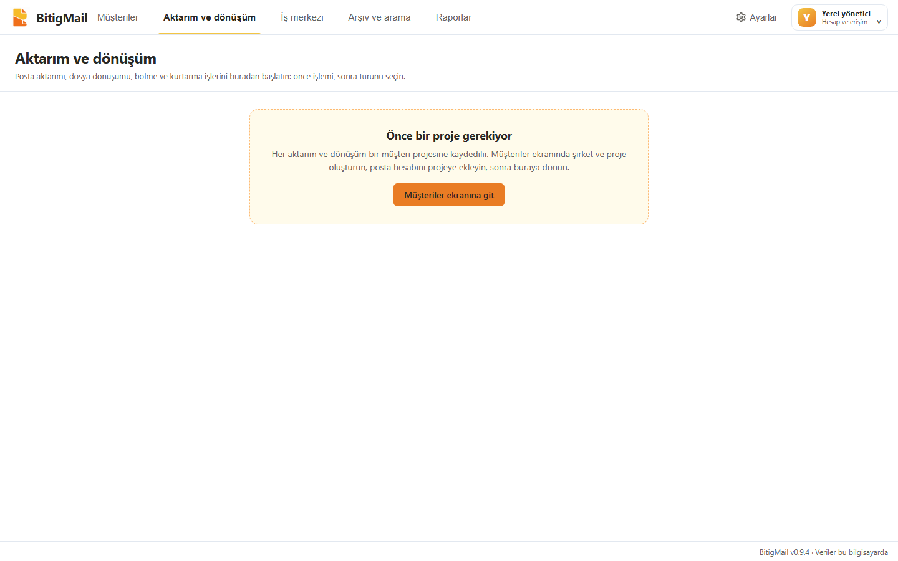

<a id="ekran-duzeni"></a>

## 6. Ekran düzeni

- **Üst menü**, iş sırasıyla: **Müşteriler → Aktarım ve dönüşüm → İş merkezi → Arşiv ve arama → Raporlar**.
- Sağ üstte **Ayarlar** ve **hesap düğmesi** (ör. "Yerel yönetici · Hesap ve erişim").
- Her ekranın başında bir başlık ve tek cümlelik açıklama vardır.
- Alttaki durum çubuğu solda seçili projeyi ya da müşteri/proje sayısını, sağda sürümü gösterir: "BitigMail v0.9.4 · Veriler bu bilgisayarda".
- Biçim imzası, hash gibi teknik bilgiler ekranlarda **Teknik ayrıntılar** başlığı altında kapalı durur; gerektiğinde açılır.
- Oturum açılmış uygulamada örnek/demo kayıt yoktur. Gördüğünüz her müşteri, proje ve iş gerçek kayıttır.

<a id="musteriler"></a>

## 7. Müşteriler

Müşteri şirketlerini, projelerini ve projelere bağlı posta hesaplarını yönettiğiniz ekran.

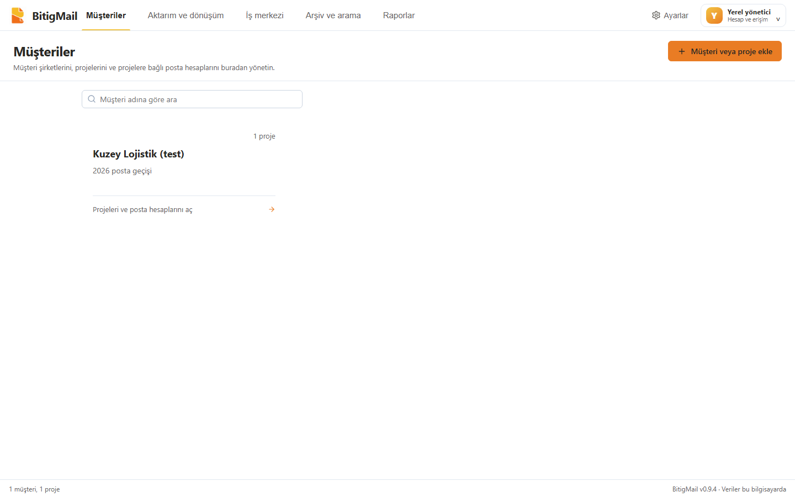

**Nasıl kullanılır**

- Müşteriler kart olarak listelenir; üstteki kutuyla ada göre aranır. Kartta proje sayısı ve proje adları görünür.
- Yönetici sağ üstteki **Müşteri veya proje ekle** ile yeni müşteri ya da mevcut müşteriye proje ekler.
- Karttaki **Projeleri ve posta hesaplarını aç** müşteri sayfasını açar.

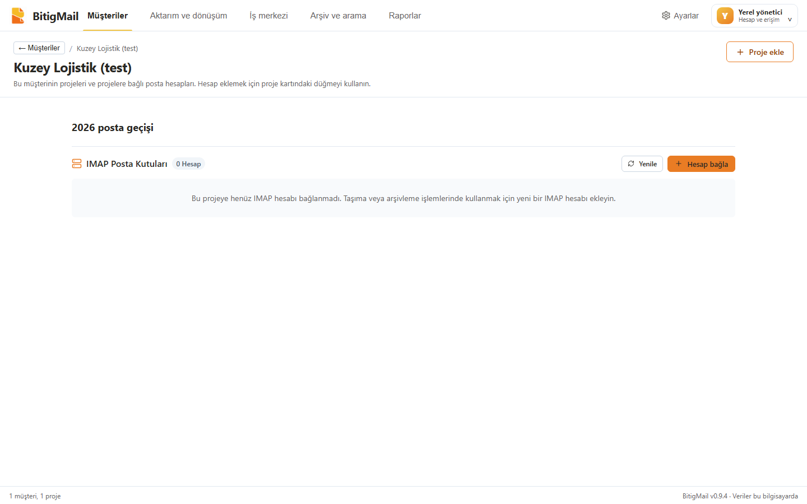

- Müşteri sayfasında her proje bir karttır. **Hesap bağla** ile projeye posta hesabı eklenir (IMAP; Microsoft ve Google bağlantıları da buradan). **Yenile** hesap listesini tazeler. Sağ üstte **Proje ekle** vardır.
- IMAP ve POP hesaplarında bağlantı güvenliği seçilir: SSL/TLS (varsayılan), zorunlu STARTTLS ya da açıkça onaylanan şifresiz bağlantı. Sunucu ya da port değişirse şifresiz bağlantı onayı yeniden istenir.

**Sınırlar**

- Operatör yalnız yetkili olduğu projeleri görür; müşteri ve proje oluşturamaz.
- Posta parolaları ve OAuth belirteçleri bu bilgisayarda Windows DPAPI ile şifreli saklanır; raporlara ve günlüklere yazılmaz.

<a id="hesap-dugmesi"></a>

## 8. Hesap düğmesi: hesap ve çalışma alanları

Sağ üstteki hesap düğmesi "Hesap ve çalışma alanları" panelini açar.

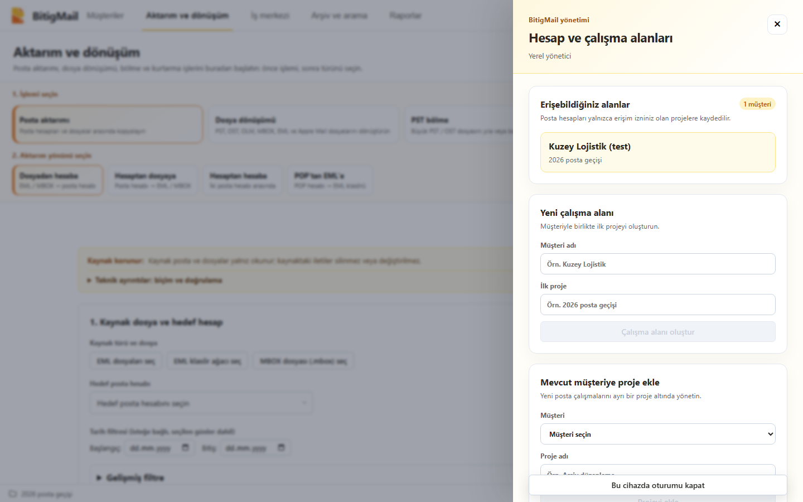

- **Erişebildiğiniz alanlar:** Erişim izniniz olan müşteri ve projeler. Posta hesapları yalnız bu projelere kaydedilir.
- **Yeni çalışma alanı** (yalnız yönetici): Müşteri adı ve ilk proje birlikte oluşturulur.
- **Mevcut müşteriye proje ekle** (yalnız yönetici).
- **Yeni kullanıcı** (yalnız yönetici): Kullanıcı adı, geçici parola, rol (**Yönetici** ya da **Operatör**) ve operatör için erişebileceği müşteri/proje seçilir.
- **Bu cihazda oturumu kapat.**

Yeni bir proje operatöre kendiliğinden yetki vermez; yetkiyi yönetici ayrıca verir. Son etkin yönetici kaldırılamaz.

<a id="aktarim"></a>

## 9. Aktarım ve dönüşüm

Bütün işler buradan başlar. Ekran üç adımlıdır:

1. **İşlemi seçin:** Posta aktarımı, Dosya dönüşümü, PST bölme, Veri kurtarma.
2. **Türünü ya da yönünü seçin** (bölme ve kurtarmada bu adım yoktur).
3. Ekranda **yalnız o akışın adımları** görünür.

Sağ üstte işin kaydedileceği **Müşteri** ve **Proje** seçilir. Proje yoksa ekran sizi Müşteriler'e yönlendirir (bkz. [Başlarken](#baslarken)).

Her akışın başında kısa bir uyarı kutusu vardır (ör. "Kaynak korunur: Kaynak posta ve dosyalar yalnız okunur; kaynaktaki iletiler silinmez veya değiştirilmez"). Teknik ayrıntılar bu kutunun altında açılır.

### 9.1 Posta aktarımı

Posta hesapları ve dosyalar arasında kopyalama. Dört yön vardır. **Hesapları yönet** düğmesi müşteri sayfasına, **Hesapları yenile** proje hesaplarını yeniden okumaya yarar.

#### Dosyadan hesaba (EML / MBOX → posta hesabı)


- Kaynak: EML dosyaları, EML klasör ağacı ya da bir MBOX dosyası (`.mbox`). Hedef: projeye bağlı bir IMAP hesabı.
- Tarih filtresi isteğe bağlıdır; seçilen günler dahildir. **Gelişmiş filtre** açılır bölümdedir (gönderen, alıcı, konu, gövde, ek, boyut gibi koşullar; VE/VEYA).
- Önizleme → başlat → hedef hesapta doğrulama → rapor.

#### Hesaptan dosyaya (posta hesabı → EML / MBOX)

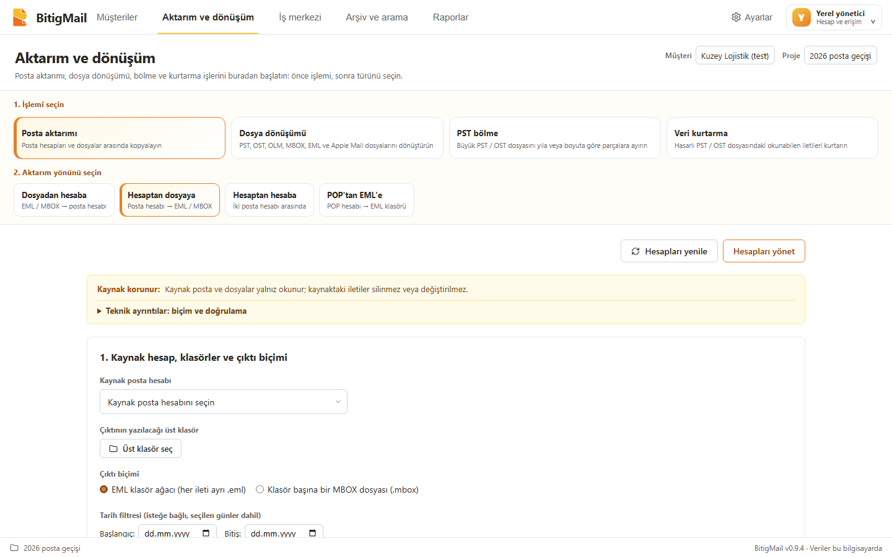

- Kaynak posta hesabı ve klasörleri seçilir; çıktının yazılacağı üst klasör seçilir.
- Çıktı biçimi: **EML klasör ağacı** (her ileti ayrı `.eml`) ya da **klasör başına bir MBOX dosyası**.
- Sunucudaki tarih ve işaret bilgileri dosya biçiminde doğal olarak taşınamadığından ayrı bir manifest dosyasına yazılır. Kaynak salt okunur.

#### Hesaptan hesaba (iki posta hesabı arasında)

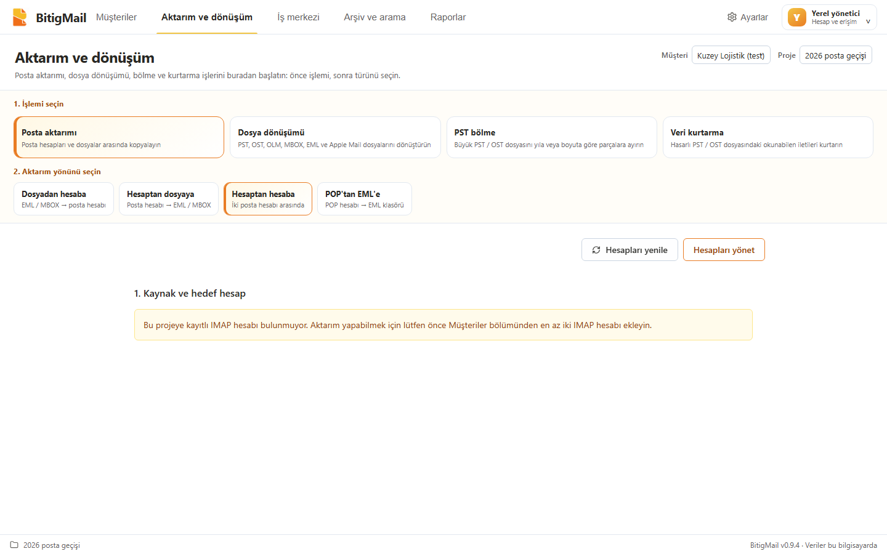

- Aynı projedeki iki IMAP hesabı arasında kopyalama: klasör eşleme, filtre, önizleme, doğrulama ve desteklenen kesintilerden devam.
- Bu bir **kopyalamadır**; kaynak hesaptaki iletiler silinmez.
- Projede en az iki IMAP hesabı yoksa ekran bunu söyler (görüntüdeki durum).

#### POP'tan EML'e (POP hesabı → EML klasörü)

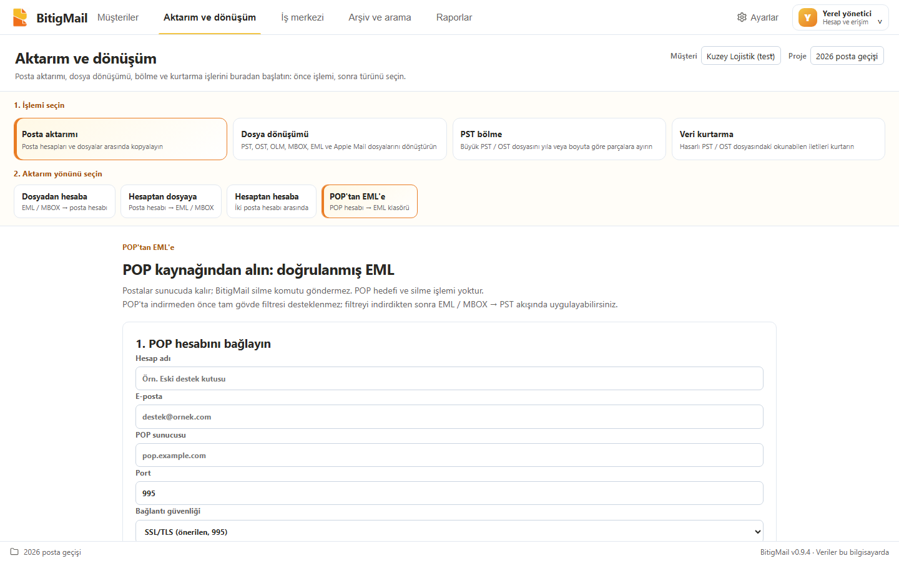

- POP hesabı bu ekranda bağlanır (hesap adı, e-posta, sunucu, port, bağlantı güvenliği; SSL/TLS önerilen, port 995).
- POP **yalnız kaynak** olabilir; POP hedefi yoktur. Postalar sunucuda kalır, BitigMail silme komutu göndermez.
- POP'ta indirmeden önce tam gövde filtresi yoktur. Filtreyi, indirdikten sonra EML / MBOX → PST akışında uygulayın.

### 9.2 Dosya dönüşümü

Dört tür vardır. PST üreten dönüşümler Aspose deneme sürümüyle çalışır (bkz. [Bilinen sınırlar](#sinirlar)). Ekranda "Motor hazır" işareti yerel motorun bağlı olduğunu gösterir.

#### OST → PST

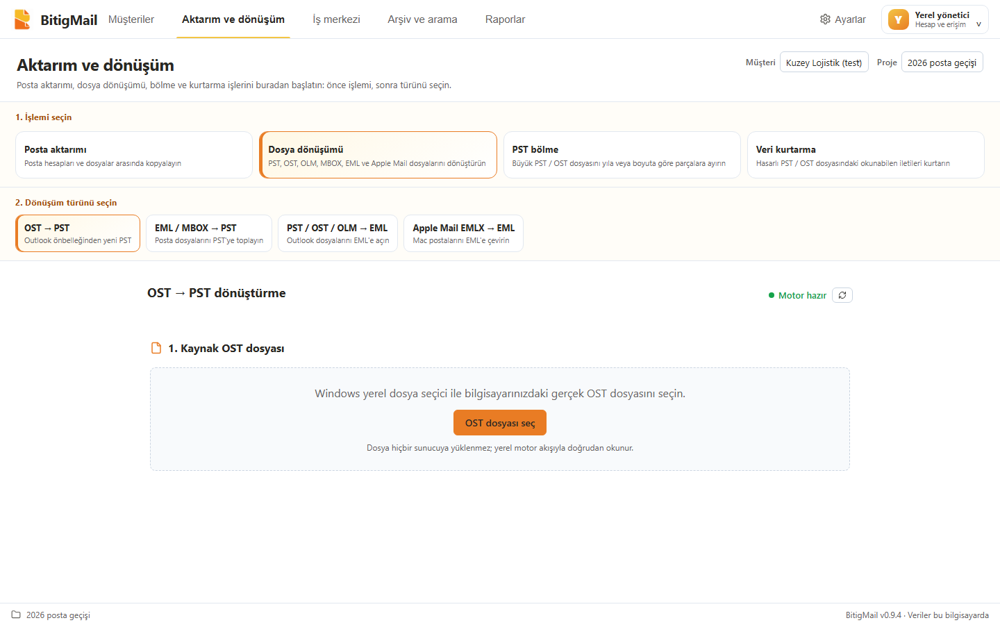

- Outlook önbellek dosyasından (OST) yeni bir PST oluşturur. Eski hesap ya da Outlook profili gerekmez.
- **OST dosyası seç** ile Windows dosya seçicisi açılır; dosya hiçbir sunucuya yüklenmez.
- Klasör ve tarih seçimi (Türkiye saati, başlangıç ve bitiş günü dahil), ileti/ek önizlemesi, yeni PST konumu, başlat, doğrulama ve rapor.

#### EML / MBOX → PST

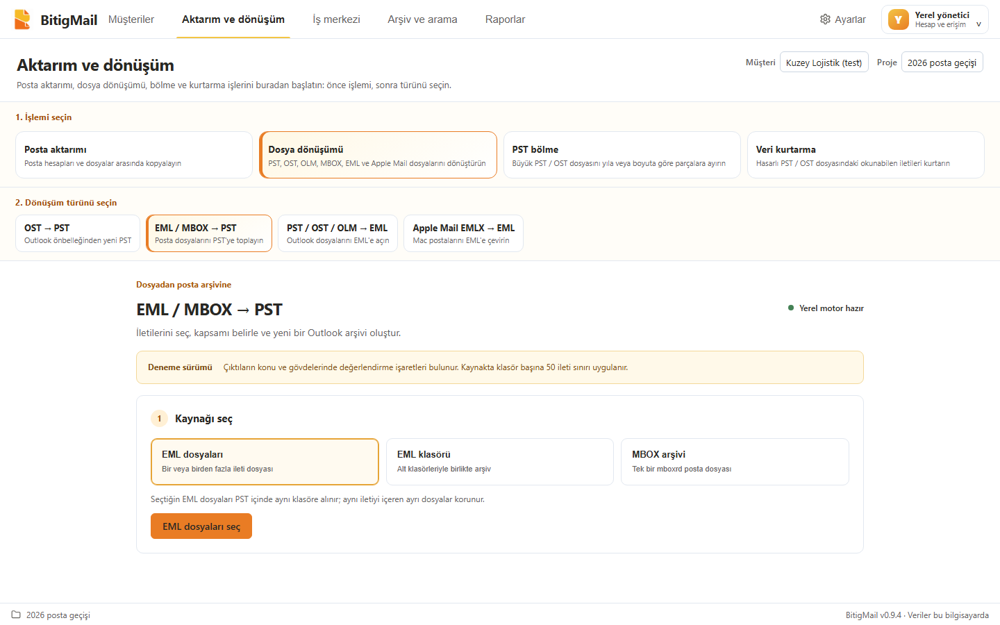

- Kaynak: EML dosyaları, alt klasörleriyle EML klasörü ya da tek bir **mboxrd** MBOX dosyası. Çıktı yeni bir PST.
- Seçilen EML dosyaları PST'de aynı klasöre alınır; aynı iletiyi içeren ayrı dosyalar ayrı korunur. EML klasörünün yapısı korunur.
- Ekrandaki "Deneme sürümü" kutusu: çıktıların konu ve gövdelerinde değerlendirme işaretleri bulunur; kaynakta klasör başına 50 ileti sınırı uygulanır.

#### PST / OST / OLM → EML

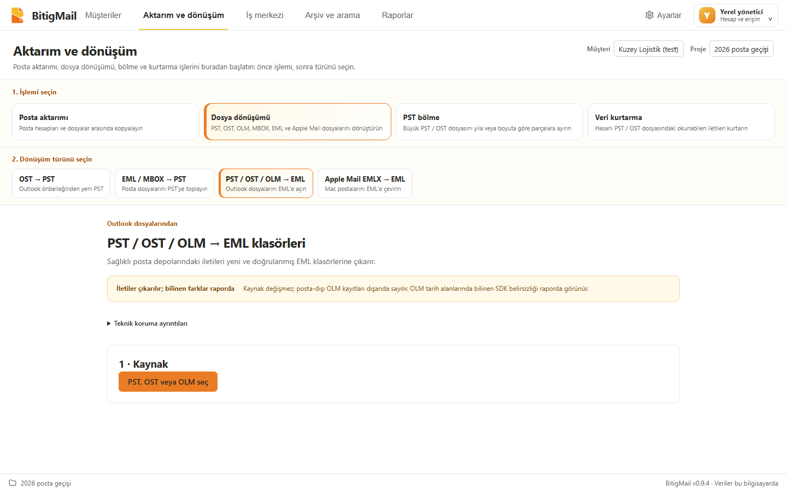

- Sağlıklı Outlook dosyalarındaki (PST, OST, Mac için Outlook OLM) iletileri yeni ve doğrulanmış EML klasörlerine çıkarır.
- Yalnız posta: OLM'deki kişi, takvim ve görev kayıtları dışarıda sayılır.
- OLM tarih alanlarında bilinen bir belirsizlik var; raporda görünür ve bu çıktıyla sonraki işlerde tarih filtresi kullanılamaz.
- Hasarlı dosyalar için bu ekran değil, [Veri kurtarma](#veri-kurtarma) kullanılır.

#### Apple Mail EMLX → EML

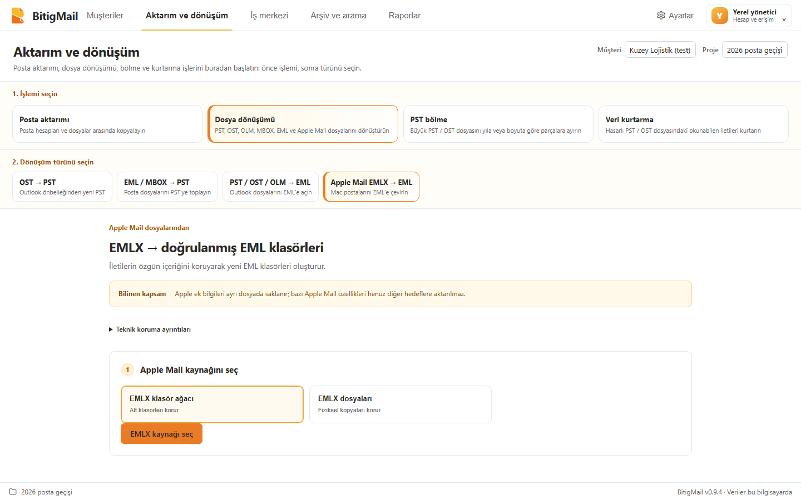

- Mac'ten gelen Apple Mail iletilerini (EMLX klasör ağacı ya da EMLX dosyaları) özgün içeriği koruyarak yeni EML klasörlerine çevirir.
- Apple'ın ek bilgileri ayrı bir dosyada saklanır; bazı Apple Mail özellikleri (özgün tarih ve işaret anlamı) henüz diğer hedeflere aktarılmaz, bu yüzden sonraki işlerde tarih filtresi kullanılamaz.
- Apple Mail'in `.mbox` klasörü düz bir MBOX dosyası sayılmaz.

Oluşan EML klasörleri daha sonra Posta aktarımı (Dosyadan hesaba), EML / MBOX → PST ya da arşive ekleme gibi akışlarda kaynak olarak kullanılabilir.

### 9.3 PST bölme

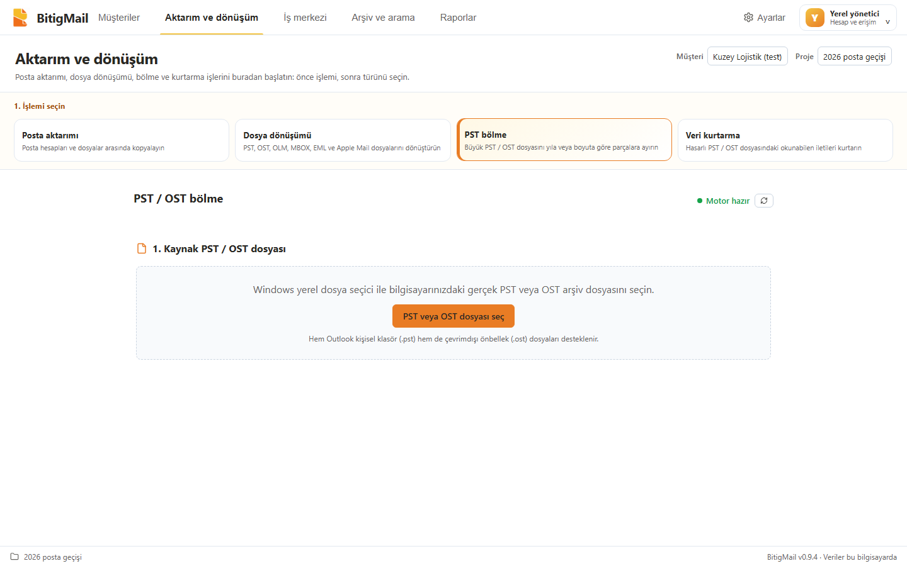

- Büyük bir PST ya da OST dosyasını **yıla** veya **dosya boyutuna** göre yeni PST parçalarına ayırır.
- Klasör ve tarih filtresi seçilebilir. Hedef üst klasörde yeni bir arşiv klasörü açılır; parçalar ve manifest buraya yazılır.
- Boyut sınırı, kapanmış dosyanın gerçek boyutuna uygulanır. Tek bir ileti ekleriyle sınırı aşıyorsa iş durur.
- Kaynak dosya değişmez. Aspose deneme sınırları burada da geçerlidir.

<a id="veri-kurtarma"></a>

### 9.4 Veri kurtarma

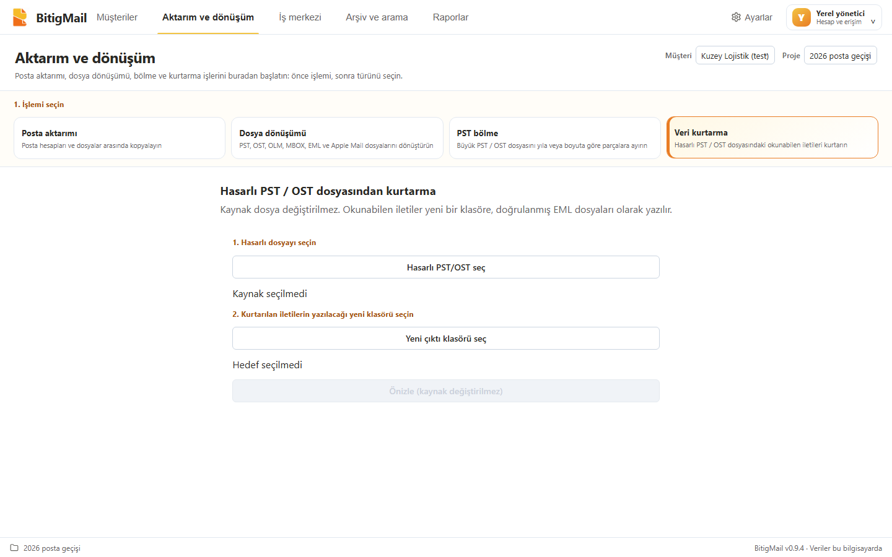

- Hasarlı bir PST/OST dosyasından **okunabilen** iletileri yeni bir klasöre doğrulanmış EML dosyaları olarak çıkarır.
- Adımlar: hasarlı dosyayı seç → yeni çıktı klasörü seç → **Önizle (kaynak değiştirilmez)** → başlat → rapor.
- Okuma ayrı bir işçi süreçte yapılır; takılan bir okuma uygulamanın geri kalanını kilitlemez.
- Raporda sonuç türleri ayrıdır: sağlıklı çıkarma, kısmi kurtarma, okunamayan kaynak, iptal, hata. Toplam bilinmiyorsa uydurma bir yüzde gösterilmez.
- Kaynak yerinde onarılmaz; silinmiş öğe tarama (undelete) yoktur.
- **Yalnız küçük, kontrollü hasarlarla doğrulandı.** Gerçek, geniş çaplı hasarlı dosyalarla kabul yapılmadı.

<a id="is-merkezi"></a>

## 10. İş merkezi

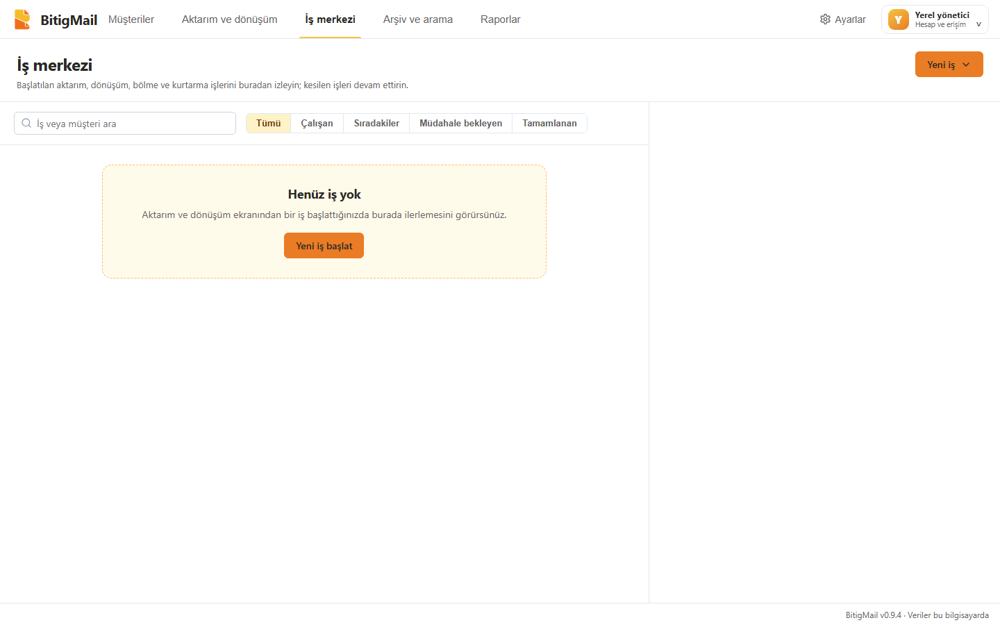

Başlatılan aktarım, dönüşüm, bölme ve kurtarma işlerinin izlendiği ekran.

- Sekmeler: **Tümü, Çalışan, Sıradakiler, Müdahale bekleyen, Tamamlanan**. Üstte iş veya müşteri adına göre arama.
- Bir işi seçince sağ bölmede ayrıntısı açılır (ilerleme, son doğrulama, sonuç).
- Çalışan işi **duraklatabilir** ve sürdürebilirsiniz. Kesilen işler, desteklenen akışlarda kaydedilmiş plan üzerinden **açıkça** devam ettirilir.
- Bekleyen işlerin önceliği değiştirilebilir; öncelik çalışan işi kesmez.
- **Yeni iş** düğmesiyle yeni bir iş başlatılır; iş Aktarım ve dönüşüm ekranında kurulur.

**Sınırlar**

- Aynı anda **1 iş** çalışır, **32'ye kadar** iş bekleyebilir.
- Uygulama yeniden açıldığında kuyruk kendiliğinden başlamaz.
- Her akış her kesintiden otomatik devam etmez; devam yalnız desteklenen akışlarda ve sizin başlatmanızla olur.

<a id="arsiv"></a>

## 11. Arşiv ve arama

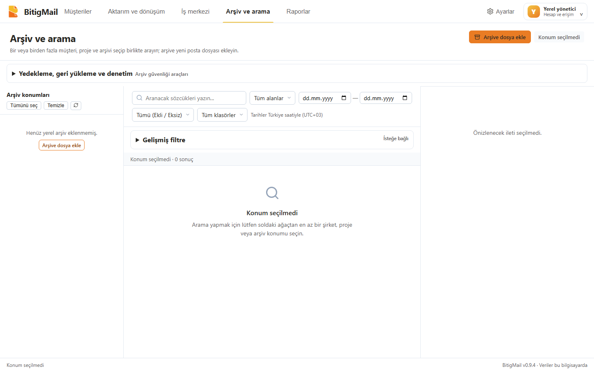

Bu bilgisayardaki yönetilen arşivde bir ya da birden fazla müşteri, proje ve arşivi seçip birlikte arama yaptığınız ekran.

- **Arşive dosya ekle:** EML ya da mboxrd dosyalarını arşive alır. Ham ileti ve manifest saklanır; arama dizini bunlardan kurulur ve gerekirse yeniden kurulabilir.
- **Arşiv konumları** (sol): şirket → proje → arşiv ağacından bir veya birden çok konum seçilir (**Tümünü seç**, **Temizle**).
- **Arama** (orta): sözcük, alan (Tüm alanlar), tarih aralığı (Türkiye saati, UTC+03), ekli/eksiz, klasör ve açılır **Gelişmiş filtre**. Sonuçlarda her iletinin hangi müşteri/proje/arşivden geldiği görünür.
- **Önizleme** (sağ): seçili iletiyi güvenli gösterir; HTML içindeki betikler çalıştırılmaz, uzak görseller kendiliğinden yüklenmez.
- **Seçili sonuçları EML olarak dışa aktarma:** sonuçlardan seçtiklerinizi yeni bir EML klasörüne çıkarır; içerik özetle doğrulanır.

**Yedekleme, geri yükleme ve denetim** (açılır bölüm):

- Arşiv yedeği alma ve geri yükleme. Geri yükleme yeni kimliklerle yapılır; mevcut arşivler korunur. Posta hesapları ve kimlik bilgileri yedeğe dahil edilmez.
- **Saklama önizlemesi:** belirtilen yaştan eski öğeleri gösterir. **Yalnız önizlemedir; hiçbir şey silmez.** Hukuki saklama güvencesi değildir.
- **Denetim bütünlüğünü kontrol et:** işlem kayıtlarının zincirini doğrular. Bu kayıt değiştirilemez bir hukuki kayıt sayılmaz.

<a id="raporlar"></a>

## 12. Raporlar

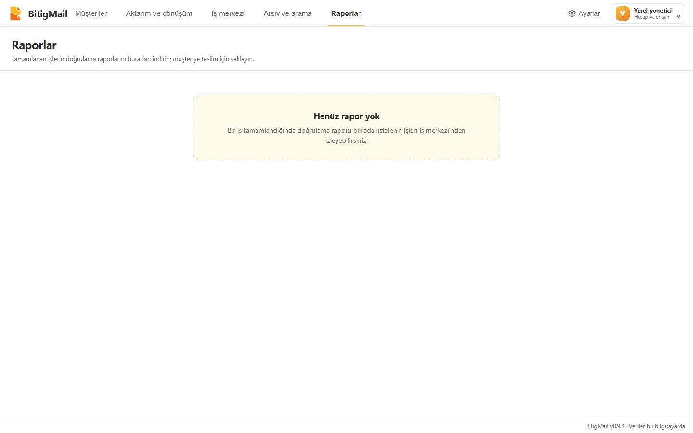

- Tamamlanan işlerin doğrulama raporları burada listelenir; **JSON** olarak indirilir ve müşteriye teslim için saklanabilir.
- Raporda işlenen, atlanan, kısmi ve doğrulanamayan öğeler ayrı yazılır. "İş bitti" bildirimi tek başına tam içerik sadakati demek değildir; raporu okuyun.
- Henüz biten iş yoksa ekran "Henüz rapor yok" der.

<a id="ayarlar"></a>

## 13. Ayarlar

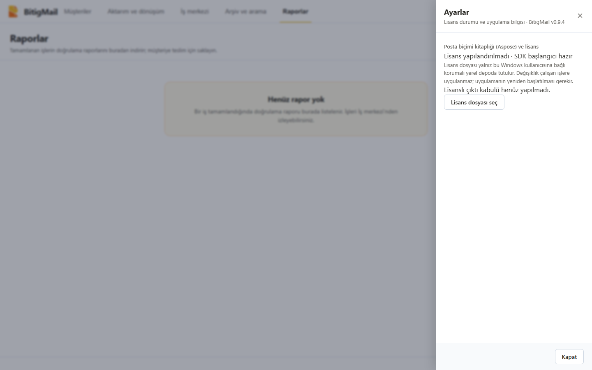

- **Posta biçimi kitaplığı (Aspose) ve lisans:** lisans durumu (ör. "Lisans yapılandırılmadı · SDK başlangıcı hazır").
- **Lisans dosyası seç:** lisans dosyası yalnız bu Windows kullanıcısına bağlı korumalı yerel depoda tutulur. Değişiklik çalışan işlere uygulanmaz; uygulamayı tepsiden **Çıkış** ile kapatıp yeniden açın.
- Başlıkta sürüm bilgisi (ör. "BitigMail v0.9.4").
- Ticari lisans henüz yok; "Lisanslı çıktı kabulü henüz yapılmadı" uyarısı bu yüzdendir.

<a id="guvenlik"></a>

## 14. Temel güvenlik ilkeleri

- **Kaynak korunur.** Kaynak dosyalar ve posta kutuları yalnız okunur. IMAP'te silme/EXPUNGE, POP'ta DELE gönderilmez. Arayüzde "aktarım" ya da "taşıma" denmesi kaynağı silme izni değildir.
- **Önce önizleme.** Önizleme kapsamı ve filtreyi sabitler. Seçim değişirse yeni önizleme gerekir.
- **Dosya oluşması başarı değildir.** Çıktı yeniden açılır; özet (hash), ileti ve ek sayılarıyla doğrulanır; sonuç rapora yazılır.
- **Mevcut hedefin üzerine yazılmaz.** Çıktı yeni bir yere üretilir.
- **Aynı Message-ID aynı ileti demek değildir.** Varsayılan olarak fiziksel kopyalar korunur; yinelenenleri ayıklamak açık bir seçimdir.
- **Sırlar yerelde, şifreli.** Uygulama parolaları özetlenerek; posta parolaları ve OAuth belirteçleri Windows DPAPI ile saklanır. Raporlara ve günlüklere sır yazılmaz.
- **Bağlantı güvenliği.** Varsayılan SSL/TLS; zorunlu STARTTLS seçilebilir; şifresiz bağlantı yalnız hesap bazında açık onayla. Kendiliğinden şifresize düşme ya da sertifika denetimini atlama yoktur.
- **Yetki sunucu tarafında denetlenir.** Operatör yalnız izinli projelerde iş yapar. Yerel rol modeli, aynı Windows kullanıcısıyla diske erişebilen bir programa karşı işletim sistemi yalıtımı değildir.
- **Disk kontrolü tahmindir.** Yetersiz ya da bilinmeyen alanda iş başlamaz; ama kontrol alan ayırmaz, kapasite garantisi vermez.

<a id="sinirlar"></a>

## 15. Bilinen sınırlar

- **Aspose deneme sürümü.** PST/OST işleyen akışlarda (OST → PST, EML/MBOX → PST, PST bölme, PST/OST → EML, kurtarma) çıktılarda değerlendirme işaretleri bulunur ve herhangi bir klasöründe **50'den fazla öğe** olan PST/OST kaynakları engellenir. IMAP aktarımlarında bu sınır yoktur. İşaretler kaldırılmaz; sınır aşılmaz.
- **MBOX yalnız mboxrd.** mboxo, mboxcl, mboxcl2 desteklenmez. Dosya uzantısı biçimi kanıtlamaz.
- **Canlı sağlayıcı pilotu yok.** Microsoft 365, kişisel Outlook.com ve Google bağlantı altyapısı yerel testlerden geçti; gerçek hesaplarla canlı pilot yapılmadı (yol haritasında 10. aşama). Şirket içi Exchange yalnız genel IMAP düzeyinde; doğrudan Exchange/Graph/EWS desteği yok.
- **Büyük ve hasarlı dosya kabulü yok.** En büyük test yaklaşık 1 GiB'dı (8.192 ileti, 2.464 ek). 10–100 GB ölçeğinde ve gerçek hasarlı dosyalarla kabul yapılmadı. Ölçülen süreler tek veri setine aittir; hız ya da bellek garantisi değildir.
- **OLM ve EMLX tarihleri.** Özgün tarih anlamı çözülmediği için bu kaynaklardan gelen çıktılarda sonraki tarih filtreleri engellenir.
- **Kişi, takvim, görev** aktarımı kapsam dışı; yalnız posta.
- **İmzasız iç sürüm.** Kod imzalama sertifikası yok; temiz bir Windows kurulumunda kabul testi yapılmadı.

<a id="sss"></a>

## 16. Sık sorulanlar

**Pencereyi kapattım ama uygulama hâlâ çalışıyor.**
Doğru: X düğmesi uygulamayı sistem tepsisine indirir, işler sürer. Tamamen çıkmak için tepsi simgesinden **Çıkış** seçin.

**Güncelleme "uygulama çalışıyor" diye reddedildi.**
Uygulamadan tepsideki **Çıkış** ile çıkın, kapanmasını bekleyin, sonra kurulum komutunu yeniden çalıştırın. Süreci Görev Yöneticisi'nden zorla kapatmayın.

**Aktarım ekranında iş seçemiyorum.**
Önce bir müşteri ve proje gerekir. Müşteriler ekranında oluşturun; hesap gerektiren akışlar için projeye hesap bağlayın.

**"Hesaptan hesaba" için hesap listesi boş.**
Bu akış aynı projede en az iki IMAP hesabı ister. Müşteri sayfasında proje kartındaki **Hesap bağla** ile ekleyin, sonra **Hesapları yenile**.

**BitigMail kaynak hesaptaki postaları siler mi?**
Hayır. Hiçbir akış kaynakta silme yapmaz; "Hesaptan hesaba" bir kopyalamadır.

**PST çıktısında konuya garip bir ek yazı gelmiş.**
Bu Aspose deneme sürümünün değerlendirme işaretidir. Ticari lisans olmadan kaldırılamaz.

**PST/OST dosyam reddedildi.**
Deneme sürümü, herhangi bir klasöründe 50'den fazla öğe olan PST/OST kaynaklarını engeller. Ticari lisans gelene kadar bu sınır sürer.

**MBOX dosyam kabul edilmiyor.**
Yalnız mboxrd biçimi desteklenir. Başka bir MBOX türüyse önce desteklenen bir yoldan EML'e çevirmeniz gerekir.

**Operatör bir projeyi göremiyor.**
Yönetici, hesap düğmesindeki panelden operatöre o proje için yetki vermelidir. Yeni projeler operatöre kendiliğinden açılmaz.

**Uygulamayı kaldırırsam arşivlerim gider mi?**
Hayır; kaldırma kullanıcı verisini korur. Yine de kaldırma bir yedek değildir; önemli arşivler için Arşiv ve arama → Yedekleme bölümünü kullanın.

**Lisans dosyasını seçtim ama değişmedi.**
Lisans değişikliği çalışan işlere uygulanmaz. Uygulamayı tepsiden **Çıkış** ile kapatıp yeniden açın.
